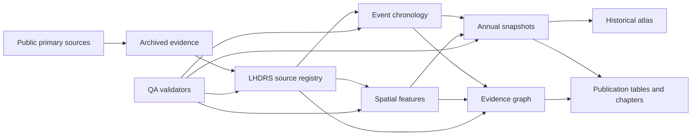
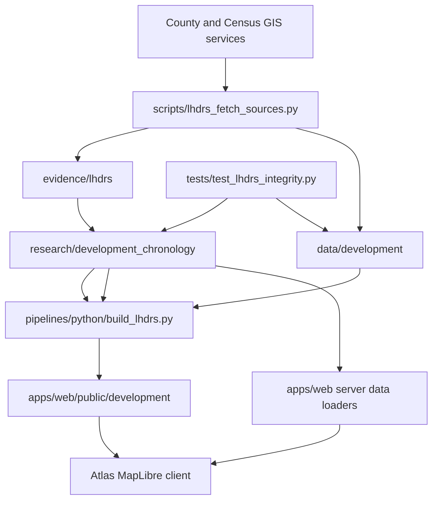

# LHDRS Architecture and Dependency Map

## System Boundary

LHDRS is a historical-development workstream inside the existing repository. It reuses the
source-grading, GIS, Next.js, and testing infrastructure while keeping its claims and data
files separate from environmental-health analysis.

## Repository Dependencies

## Canonical Versus Generated

Canonical, hand-reviewed records live under `research/development_chronology/`. Public
source copies live under `evidence/lhdrs/`. Derived GIS and QA outputs live under
`data/development/`. Files under `apps/web/public/development/` are generated publication
copies and should not be edited directly.

## Evidence Graph

Every public atlas event links to one or more LHDRS source IDs. Spatial features carry the
same source IDs and precision labels. `knowledge_graph.csv` makes the most important links
explicit; the atlas can trace an event or feature back to its registry row and public URL.

## Automation Opportunities

- Re-query the Census and County tract services and report changed object IDs.
- Resolve tract-map relationship records to map-sheet documents.
- OCR and page-index the County planning documents.
- Compare newly archived imagery against the existing inventory.
- Generate annual tract snapshots and future construction/proximity tables.
- Validate URLs, hashes, temporal ranges, geometries, citations, and orphan records.

## Current Data Gates

Tract recording chronology is now automatable. Grading, vertical construction, road,
utility, neighborhood occupancy, and park-boundary chronology still require permit,
as-built, assessor, or registered-imagery evidence. The application presents those layers
as unavailable rather than estimating them silently.

The first-edition stop condition and the evidence required to reopen blocked outputs are
maintained in `docs/lhdrs/RECURSIVE_GAP_REVIEW.md`.
