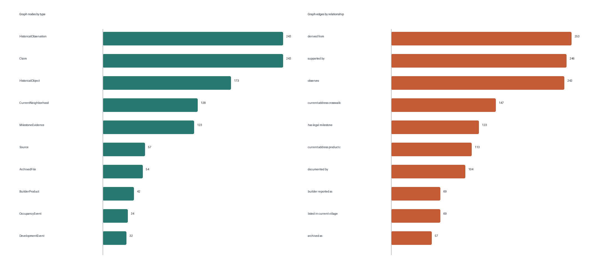

# Mission 4 evidence graph summary

The normalized graph contains **724 nodes**, **796 edges**, and **23 relationship types**. All 18 first-edition edges are preserved. New edges connect sources to archives, observations to objects and sources, claims to observations, tracts to legal milestones, DSA projects to schools, community activity and occupancy events to sources, imagery reviews to frames, and annual snapshots to milestones.

Every edge now carries valid-time fields, evidence IDs, source IDs, confidence, version, review status, and limitations. Blank valid-time values mean the relationship is not temporally bounded; they are not interpreted as indefinite historical truth.

The seven required example queries are stored in `data/development/graph_query_results.json`. Queries that require dated occupancy or active-construction geometry return `blocked`, not an empty factual answer.

