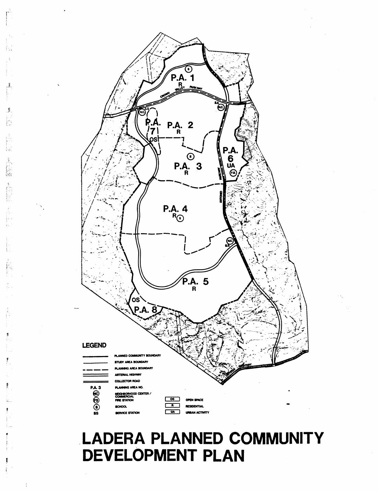

# Ladera Ranch Historical Development Atlas

Generated 2026-07-26 from the LHDRS canonical registries.

> **Scope boundary:** This atlas reconstructs historical planning and development. It does not infer contamination, exposure, health effects, or causation. Tract-map recording is a legal subdivision milestone, not proof of grading, construction, sale, road opening, or occupancy.

## Evidence at a Glance

| Sources | Chronology events | Annual chapters | Recorded tract polygons | Schools | Open questions |
|---|---|---|---|---|---|
| 19 | 34 | 12 | 123 | 4 | 15 |

## Method

The system separates source records, observed events, regulatory obligations, annual summaries, and generated geometry. Exact dates are not expanded into broader claims. Approximate or conflicting statements retain their source wording, confidence, and limitations. Blank neighborhood fields are unresolved rather than estimated.

Distances from occupied neighborhoods to active construction are not calculated because the required dated polygon layers do not yet exist. The blocked gate is recorded in `proximity_analysis_status.csv`.

## Planned Baseline

| PA | Land use | Max dwellings | Residential net acres | Gross acres | Profile | Source |
|---|---|---|---|---|---|---|
| 1 | residential | 1140 | 221 | 249 | Medium Density 3.5-5.0 DU/AC | `LH-SRC-OC-PC` |
| 2 | residential | 1880 | 333 | 386 | Medium Density 3.5-5.0 DU/AC | `LH-SRC-OC-PC` |
| 3 | residential | 1670 | 289 | 329 | Medium Density 5.0-6.5 DU/AC | `LH-SRC-OC-PC` |
| 4 | residential | 1650 | 472 | 503 | Medium Low Density 3.0-3.5 DU/AC | `LH-SRC-OC-PC` |
| 5 | residential | 1560 | 674 | 721 | Medium Low Density 2.0-2.5 DU/AC | `LH-SRC-OC-PC` |
| 6 | urban_activity | 200 | Unknown | 120 | Urban Activities Centers | `LH-SRC-OC-PC` |
| 7 | open_space | Unknown | Unknown | 42 | Recreation | `LH-SRC-OC-PC` |
| 8 | open_space | Unknown | Unknown | 40 | Recreation | `LH-SRC-OC-PC` |
| total | planned_community | 8100 | 1989 | 2390 | Unknown | `LH-SRC-OC-PC` |

## Annual Reconstruction

### 1997: Approval Recalled By Developer

Developer retrospective places County approval in 1997

- Recorded tract maps: 0 that year, 0 cumulative
- Homes sold as of published milestone: 0
- Schools open: 0
- Confidence: low
- Sources: `LH-SRC-RMV-PLANNING`, `LH-SRC-OC-EIR-CERT`
- Limitations: Official County record dates Final EIR 555 certification to 1995-10-17; the exact broader 1997 action remains unidentified; current CDP boundary is not the entitlement boundary

| Date | Event | Class | Confidence | Sources | Notes |
|---|---|---|---|---|---|
| 1997-01-01 | Developer retrospective places County approval in 1997 | documented_approximate | low | `LH-SRC-RMV-PLANNING` | Preserved as a source claim, not treated as the exact entitlement action |

### 1998: Development Started

Development begins and original standards approved

- Recorded tract maps: 1 that year, 1 cumulative
- Homes sold as of published milestone: 0
- Schools open: 0
- Confidence: medium
- Sources: `LH-SRC-ULI-CASE`, `LH-SRC-OC-ADS`
- Limitations: No dated grading or construction polygons yet; tract counts are generated

| Date | Event | Class | Confidence | Sources | Notes |
|---|---|---|---|---|---|
| 1998-01-01 | Development begins | documented_approximate | medium | `LH-SRC-ULI-CASE` | Substantial completion is separately dated to 2006 |
| 1998-04-07 | Original alternative development standards approved | documented_exact | high | `LH-SRC-OC-ADS` | Regulatory milestone only |

### 1999: First Sales And Occupancy

Utility package and dirt-tour sales and first resident

- Recorded tract maps: 14 that year, 15 cumulative
- Homes sold as of published milestone: 93
- Schools open: 0
- Confidence: medium
- Sources: `LH-SRC-CEQANET-UTILITIES`, `LH-SRC-LARMAC-TIMELINE`
- Limitations: Sales and occupancy are community-level; no village polygons

| Date | Event | Class | Confidence | Sources | Notes |
|---|---|---|---|---|---|
| 1999-03-09 | Phase 1 utility environmental record received | documented_exact | high | `LH-SRC-CEQANET-UTILITIES` | Includes domestic and nondomestic water sewer force mains pump station and lift station |
| 1999-03-09 | Alternative development standards approval | documented_exact | high | `LH-SRC-OC-ADS` | Regulatory milestone only |
| 1999-08-01 | Dirt Tour sales begin | documented_exact | medium | `LH-SRC-LARMAC-TIMELINE` | Exact day not published |
| 1999-10-01 | 93 new homes sold | documented_exact | medium | `LH-SRC-LARMAC-TIMELINE` | Sales figure awaits original sales ledger corroboration |
| 1999-12-14 | First resident moves in | documented_exact | medium | `LH-SRC-LARMAC-TIMELINE` | Community-level event; village assignment is not encoded without a primary occupancy record |

### 2000: Active Construction And Occupancy

Oak Knoll Clubhouse opens

- Recorded tract maps: 20 that year, 35 cumulative
- Homes sold as of published milestone: 562
- Schools open: 0
- Confidence: medium
- Sources: `LH-SRC-LARMAC-TIMELINE`
- Limitations: No permit-level construction status

| Date | Event | Class | Confidence | Sources | Notes |
|---|---|---|---|---|---|
| 2000-02-28 | Chief County Engineer approves standards supplement 3 | documented_exact | high | `LH-SRC-OC-ADS` | Regulatory milestone only |
| 2000-03-01 | 562 total new homes sold | documented_exact | medium | `LH-SRC-LARMAC-TIMELINE` | Timeline reports 469 new and 562 total |
| 2000-03-01 | Oak Knoll Clubhouse opens | documented_exact | medium | `LH-SRC-LARMAC-TIMELINE` | Exact day not published |

### 2001: Active Construction And Occupancy

Sports Park Chaparral School Bridgepark Plaza and Town Green open

- Recorded tract maps: 24 that year, 59 cumulative
- Homes sold as of published milestone: 1546
- Schools open: 1
- Confidence: medium
- Sources: `LH-SRC-LARMAC-TIMELINE`, `LH-SRC-CUSD-CHAPARRAL`
- Limitations: School count treats September opening as active by year end

| Date | Event | Class | Confidence | Sources | Notes |
|---|---|---|---|---|---|
| 2001-02-01 | 1546 total new homes sold | documented_exact | medium | `LH-SRC-LARMAC-TIMELINE` | Timeline reports 984 new and 31 neighborhoods open |
| 2001-06-01 | Ladera Ranch Sports Park opens | documented_exact | medium | `LH-SRC-LARMAC-TIMELINE` | Exact day not published |
| 2001-09-01 | Chaparral Elementary opens | documented_exact | high | `LH-SRC-CUSD-CHAPARRAL` | Exact day not published |
| 2001-10-01 | Bridgepark Plaza opens | documented_exact | medium | `LH-SRC-LARMAC-TIMELINE` | Exact day not published |
| 2001-10-01 | Town Green opens | documented_exact | medium | `LH-SRC-LARMAC-TIMELINE` | Exact day not published |

### 2002: Active Construction And Occupancy

Avendale Clubhouse opens and 54 neighborhoods reported open

- Recorded tract maps: 17 that year, 76 cumulative
- Homes sold as of published milestone: 2488
- Schools open: 1
- Confidence: medium
- Sources: `LH-SRC-LARMAC-TIMELINE`
- Limitations: Neighborhood open is a marketing status not a buildout measure

| Date | Event | Class | Confidence | Sources | Notes |
|---|---|---|---|---|---|
| 2002-03-01 | 2488 total new homes sold | documented_exact | medium | `LH-SRC-LARMAC-TIMELINE` | Timeline reports 942 new and 54 neighborhoods open |
| 2002-06-01 | Avendale Village Clubhouse opens | documented_exact | medium | `LH-SRC-LARMAC-TIMELINE` | Exact day not published |

### 2003: Active Construction And Occupancy

Founders Park library and shared Ladera Ranch School open

- Recorded tract maps: 23 that year, 99 cumulative
- Homes sold as of published milestone: 3987
- Schools open: 3
- Confidence: high
- Sources: `LH-SRC-LARMAC-TIMELINE`, `LH-SRC-CUSD-LRES`, `LH-SRC-CUSD-LRMS`
- Limitations: Community timeline and school report differ by one month; official date controls school activation

| Date | Event | Class | Confidence | Sources | Notes |
|---|---|---|---|---|---|
| 2003-04-01 | 3987 total new homes sold | documented_exact | medium | `LH-SRC-LARMAC-TIMELINE` | Timeline also reports population 6112 |
| 2003-07-01 | Founders Park opens | documented_exact | medium | `LH-SRC-LARMAC-TIMELINE` | Community timeline month conflicts with school reports exact August 27 opening; events are preserved separately |
| 2003-07-01 | Ladera Ranch Library opens | documented_exact | medium | `LH-SRC-LARMAC-TIMELINE` | Exact day not published |
| 2003-07-30 | Ladera Planned Community Program revised | documented_exact | high | `LH-SRC-OC-PC` | Statistical summary amended by Orange County Planning Commission |
| 2003-08-27 | Ladera Ranch School opens | documented_exact | high | `LH-SRC-CUSD-LRES`, `LH-SRC-CUSD-LRMS` | Shared elementary and middle campus |

### 2004: Active Construction And Occupancy

School split and Flintridge and Covenant Hills clubhouses open

- Recorded tract maps: 22 that year, 121 cumulative
- Homes sold as of published milestone: 5087
- Schools open: 3
- Confidence: medium
- Sources: `LH-SRC-CUSD-LRMS`, `LH-SRC-LARMAC-TIMELINE`
- Limitations: No tract-to-village crosswalk yet

| Date | Event | Class | Confidence | Sources | Notes |
|---|---|---|---|---|---|
| 2004-01-01 | 5087 total new homes sold | documented_exact | medium | `LH-SRC-LARMAC-TIMELINE` | Timeline reports 1100 new homes since prior milestone |
| 2004-01-01 | Ladera Ranch School splits into elementary and middle schools | documented_exact | high | `LH-SRC-CUSD-LRMS` | Exact date not published |
| 2004-12-01 | Flintridge and Covenant Hills village clubhouses open | documented_exact | medium | `LH-SRC-LARMAC-TIMELINE` | Exact days not published |

### 2005: Active Construction And Occupancy

Oso Grande School and three park facilities open

- Recorded tract maps: 1 that year, 122 cumulative
- Homes sold as of published milestone: 5879
- Schools open: 4
- Confidence: high
- Sources: `LH-SRC-CDE-OSO`, `LH-SRC-LARMAC-TIMELINE`
- Limitations: No construction start dates for facilities

| Date | Event | Class | Confidence | Sources | Notes |
|---|---|---|---|---|---|
| 2005-02-01 | 5879 total new homes sold | documented_exact | medium | `LH-SRC-LARMAC-TIMELINE` | Timeline reports 792 new homes since prior milestone |
| 2005-08-24 | Oso Grande Elementary opens | documented_exact | high | `LH-SRC-CDE-OSO` | Official registry date |
| 2005-11-01 | Skate Park Wagsdale Park and Terramor Water Park open | documented_exact | medium | `LH-SRC-LARMAC-TIMELINE` | Exact days not published |

### 2006: Substantially Complete

Substantial completion reported

- Recorded tract maps: 0 that year, 122 cumulative
- Homes sold as of published milestone: 6380
- Schools open: 4
- Confidence: medium
- Sources: `LH-SRC-ULI-CASE`, `LH-SRC-LARMAC-TIMELINE`
- Limitations: Substantial completion does not mean every custom lot was complete

| Date | Event | Class | Confidence | Sources | Notes |
|---|---|---|---|---|---|
| 2006-03-01 | 6380 total new homes sold | documented_exact | medium | `LH-SRC-LARMAC-TIMELINE` | Timeline reports 501 new homes since prior milestone |
| 2006-01-01 | Community substantially completed | documented_approximate | medium | `LH-SRC-ULI-CASE` | Custom lots and later sales remained |

### 2007: Sold Out Except Custom

Community sells out except custom lots

- Recorded tract maps: 0 that year, 122 cumulative
- Homes sold as of published milestone: 6585
- Schools open: 4
- Confidence: medium
- Sources: `LH-SRC-LARMAC-TIMELINE`
- Limitations: Physical buildout remains unresolved

| Date | Event | Class | Confidence | Sources | Notes |
|---|---|---|---|---|---|
| 2007-04-01 | Community sells out except custom lots | documented_exact | medium | `LH-SRC-LARMAC-TIMELINE` | Timeline reports 6585 total new homes sold |

### 2008: Late Custom Lot Phase

Additional home sales reported

- Recorded tract maps: 1 that year, 123 cumulative
- Homes sold as of published milestone: 6631
- Schools open: 4
- Confidence: medium
- Sources: `LH-SRC-LARMAC-TIMELINE`
- Limitations: Final buildout date remains unresolved

| Date | Event | Class | Confidence | Sources | Notes |
|---|---|---|---|---|---|
| 2008-01-01 | 6631 total new homes sold | documented_exact | medium | `LH-SRC-LARMAC-TIMELINE` | Later custom-lot completion remains unresolved |

## Schools

| School | Opened | Location precision | Confidence | Sources | Limitations |
|---|---|---|---|---|---|
| Chaparral Elementary School | 2001-09-01 | OpenStreetMap building centroid | high | `LH-SRC-CUSD-CHAPARRAL`, `LH-SRC-OSM-SCHOOLS` | Opening day and construction window unresolved |
| Ladera Ranch Elementary School | 2003-08-27 | OpenStreetMap shared-campus building centroid | high | `LH-SRC-CUSD-LRES`, `LH-SRC-OSM-SCHOOLS` | Planning and construction window unresolved |
| Ladera Ranch Middle School | 2003-08-27 | OpenStreetMap shared-campus building centroid | high | `LH-SRC-CUSD-LRMS`, `LH-SRC-OSM-SCHOOLS` | Separate middle-school identity dates to 2004; exact split day unresolved |
| Oso Grande Elementary School | 2005-08-24 | OpenStreetMap building centroid | high | `LH-SRC-CDE-OSO`, `LH-SRC-OSM-SCHOOLS` | Planning and construction window unresolved |

## Infrastructure Requirements

These are requirements in the County program, not completion events.

| Trigger | Value | Requirement | Source location | Limitations |
|---|---|---|---|---|
| annual | fall | Landowner must submit Annual Monitoring Report to County Administrative Office and Environmental Management Agency | PDF page 5 | No annual reports have yet been retrieved |
| before_area_plan_or_tentative_map | Unknown | Landowner must submit a Fiscal Impact Report | PDF page 9 | Submission and approval records have not yet been retrieved |
| before_grading_permit | Unknown | Applicant must obtain NPDES coverage and submit required evidence | PDF page 12 | Requirement does not establish permit issuance or grading date |
| before_grading_permit | Unknown | Applicant must submit fuel-modification and geotechnical plans or reports | PDF page 15 | Requirement does not establish permit issuance or grading date |
| before_any_building_permit | 0 | A construction contract must be awarded for either Antonio Parkway or Crown Valley Parkway as a four-lane road to their future intersection | PDF page 18 | Contract award and road completion dates are not supplied by this condition |
| before_building_permits_exceed | 2601 | Landowner must offer Crown Valley Parkway right-of-way and construction contracts must be awarded for both Antonio and Crown Valley as four-lane roads to their future intersection | PDF page 18 | Threshold is permitted units rather than sold or occupied homes |
| before_building_permits_exceed | 5001 | Construction contract must be awarded for Antonio Parkway as a six-lane road to Ortega Highway unless an approved traffic study supports four lanes | PDF page 18 | Condition includes an alternative based on an approved traffic study |
| before_building_permits_exceed | 5001 | Construction contract must be awarded for Crown Valley Parkway as a six-lane road to the Antonio Parkway intersection | PDF page 19 | Contract award and completion dates remain unresolved |
| before_building_permits_exceed | 7000 | Landowner must enter an agreement identifying how Crown Valley Parkway will be constructed between the eastern planned-community boundary and the Foothill Transportation Corridor | PDF page 19 | Agreement and construction records remain unresolved |

## Open Research Questions

| ID | Priority | Category | Question | Status | Blocked output | Next action |
|---|---|---|---|---|---|---|
| LH-TODO-001 | critical | entitlement | Which Board action adopted the original Ladera Ranch zoning and entitlement beyond certification of Final EIR 555? | open | Entitlement-action confidence | Retrieve the 1995-10-17 Board minutes and adopted instruments; do not conflate EIR certification with project approval |
| LH-TODO-002 | critical | planning | How do the numbered planning areas crosswalk to the nine named villages? | open | Village GIS and chronology | Digitize and cross-reference map sheets |
| LH-TODO-003 | critical | tracts | Which recorded tract maps belong to each village and builder? | open | Village build sequence | Retrieve map references for generated tract list |
| LH-TODO-004 | critical | grading | What were the start and completion dates and extents of mass-grading phases? | open | Annual grading polygons and proximity tables | Request permit index or query OC Development Services |
| LH-TODO-005 | critical | occupancy | What were first and substantial occupancy dates by village or tract? | open | Occupied-neighborhood annual layer | Obtain tract-level permit or assessor extracts |
| LH-TODO-006 | high | roads | When did each backbone and village road open and become County-maintained? | open | Road annual layer | Search Board agendas by tract and street |
| LH-TODO-007 | high | utilities | When were each water sewer recycled-water and storm-drain phase placed in service? | open | Utility annual layer | Retrieve SCH 1999031033 attachments and SMWD board records |
| LH-TODO-008 | high | imagery | Which public aerials cover each year from 1999 through 2006? | open | Annual visual interpretation | Query EarthExplorer NAIP and regional archives |
| LH-TODO-009 | high | schools | When did planning and construction begin for each Ladera school? | open | School construction annual layer | Search CUSD board archive by school and project number |
| LH-TODO-010 | high | parks | What are the exact opening dates and boundaries for all parks and clubhouses? | open | Park annual layer | Archive facility pages and request historical board packets |
| LH-TODO-011 | high | commercial | What opened in Bridgepark and Mercantile districts and when? | open | Commercial annual layer | Search newspapers developer brochures and permit records |
| LH-TODO-012 | high | proximity | How close was each occupied neighborhood to active construction each year? | blocked | 25m through 1000m proximity tables | Do not calculate until geometry gates are met |
| LH-TODO-013 | medium | builders | Which builders and model collections correspond to each tract? | open | Neighborhood reconstruction | Search Wayback and library ephemera |
| LH-TODO-014 | medium | buildout | When was physical buildout complete after the 2007 sellout except custom lots? | open | Atlas end date | Reconcile post-2007 custom-lot construction |
| LH-TODO-015 | medium | wind | What site-specific wind record best represents the Ladera valleys? | open | Climatology precision | Use El Toro and John Wayne only as regional context until a closer station is validated |

## Bibliography and Source Registry

### LH-SRC-OC-PC: Ladera Planned Community Program

- Publisher: County of Orange OC Development Services
- URL: https://pwds.oc.gov/sites/ocpwocds/files/import/data/files/9266.pdf
- Reliability: A2
- Archive: `evidence/documents/Ladera_Planned_Community_Program_Text_1995_rev2003.pdf` (local_copy)
- SHA-256: `1922b1c9ca24097885ced31fb88dc2e971dc72a55b63e956f97178b91cbcfb9c`
- Limitations: Scanned image PDF; the current Census boundary is not its legal boundary

### LH-SRC-OC-MAP: Ladera Ranch Planned Community Map

- Publisher: County of Orange OC Development Services
- URL: https://pwds.oc.gov/sites/ocpwocds/files/import/data/files/9268.pdf
- Reliability: A2
- Archive: `evidence/lhdrs/county/Ladera_Ranch_Planned_Community_Map.pdf` (retrieved)
- SHA-256: `42cb618abcd8e67c38418688191f18c857e91d18f2c22f3db907e5bbd5c72527`
- Limitations: Single-sheet plan; digitization and registration still required

### LH-SRC-OC-DA: Ladera Ranch Development Agreement

- Publisher: County of Orange OC Development Services
- URL: https://pwds.oc.gov/sites/ocpwocds/files/import/data/files/9272.pdf
- Reliability: A2
- Archive: `evidence/lhdrs/county/Ladera_Ranch_Development_Agreement.pdf` (retrieved)
- SHA-256: `7e9f9d1eb783f77e011bea4eaca2f72334c78a3a6d3f0a245a5d8b9c6692dff3`
- Limitations: Legal agreement does not by itself establish physical completion dates

### LH-SRC-OC-ADS: Ladera Ranch Alternative Development Standards Version 4

- Publisher: County of Orange OC Development Services
- URL: https://pwds.oc.gov/sites/ocpwocds/files/import/data/files/9270.pdf
- Reliability: A2
- Archive: `evidence/lhdrs/county/Ladera_Ranch_Alternative_Development_Standards.pdf` (retrieved)
- SHA-256: `b0fcbcdc7896d14d0c680290120591e82e0c24ad9382527add5e4f1d7b48d2c1`
- Limitations: Approval and supplement dates are regulatory milestones rather than construction dates

### LH-SRC-CENSUS-CDP: Ladera Ranch Census Designated Place boundary

- Publisher: TIGERweb US Census Bureau
- URL: https://tigerweb.geo.census.gov/arcgis/rest/services/TIGERweb/Places_CouSub_ConCity_SubMCD/MapServer/5
- Reliability: A1
- Archive: `data/development/ladera_ranch_cdp.geojson` (generated_archive)
- SHA-256: `d41979ffa6f9ccc685021d74d83201c2e884d4e2bc36320013f97e561c69b040`
- Limitations: Current statistical boundary; not the 1997 planned-community or tract boundary

### LH-SRC-OC-TRACTS: Orange County Tract Maps GIS service

- Publisher: OC Public Works, OC Survey, Geospatial Services
- URL: https://ocgis.com/arcpub/rest/services/Map_Layers/Tract_Maps/MapServer/0
- Reliability: A1
- Archive: `data/development/tract_maps.geojson` (generated_archive)
- SHA-256: `18a875915f02608d2c8ddf50af2e9c3832a787680ba5ecb06f8166158606cc61`
- Limitations: Intersection with the current CDP includes maps that cross its edge; recording does not prove construction or occupancy

### LH-SRC-OC-IMAGERY: Orange County Historical Aerial Imagery v2

- Publisher: OC Public Works, OC Survey, Geospatial Services
- URL: https://ocgis.com/arcpub/rest/services/Historic_Imagery/Historic_Imagery_v2/ImageServer
- Reliability: A1
- Archive: `evidence/lhdrs/imagery/ladera_1997_1998.png` (retrieved)
- SHA-256: `8bf3ab9ae294f1198e00791df5f2aaf91604a8db822e0e05738cc3a622b175da`
- Limitations: Frame dates can distinguish date on map from date current; source flight footprint covers only part of the display extent; scan quality varies

### LH-SRC-CEQANET-UTILITIES: Phase 1 Ladera Development Area

- Publisher: California State Clearinghouse / Santa Margarita Water District
- URL: https://ceqanet.lci.ca.gov/1999031033
- Reliability: A2
- Archive: `evidence/lhdrs/web/ceqanet_1999031033.html` (retrieved)
- SHA-256: `cb0297fbdb002c48783e7b4902597cb89c95928009f9364955a2537cd44e15b7`
- Limitations: Summary record does not provide as-built completion dates

### LH-SRC-RMV-PLANNING: Responsible Planning

- Publisher: Rancho Mission Viejo
- URL: https://www.ranchomissionviejo.com/about/responsible-planning
- Reliability: B2
- Archive: `evidence/lhdrs/web/rmv_responsible_planning.html` (fetch_failed)
- SHA-256: `unavailable`
- Limitations: Developer-authored and promotional; use for its own chronology with corroboration where possible

### LH-SRC-LARMAC-TIMELINE: Explore Ladera Ranch - Ladera Ranch through the years

- Publisher: Ladera Ranch Maintenance Corporation
- URL: https://laderalife.com/about/explore-ladera-ranch
- Reliability: B2
- Archive: `evidence/lhdrs/web/laderalife_timeline.html` (retrieved)
- SHA-256: `2c2bfac90432cfb585898806f0d9b13cf8fc2bf1da1e3b54d662183df9bc4fa7`
- Limitations: Organization-authored retrospective; sales figures appear to be interval totals and require original sales records for independent verification

### LH-SRC-ULI-CASE: Ladera Ranch case study

- Publisher: Urban Land Institute
- URL: https://casestudies.uli.org/wp-content/uploads/2016/06/Ladera-Ranch.pdf
- Reliability: B1
- Archive: `evidence/lhdrs/publications/ULI_Ladera_Ranch_Case_Study.pdf` (fetch_failed)
- SHA-256: `unavailable`
- Limitations: Retrospective case study; not a permit or as-built record

### LH-SRC-CUSD-CHAPARRAL: 2022 School Accountability Report Card - Chaparral Elementary School

- Publisher: Capistrano Unified School District
- URL: https://www.capousd.org/documents/Schools/SARCS/Elementary/2022-SARC-Chaparral-Elementary-School.pdf
- Reliability: A2
- Archive: `evidence/lhdrs/schools/2022_SARC_Chaparral_Elementary.pdf` (retrieved)
- SHA-256: `ef76f10afdc4803d0456f263638b46d3013b151ff098b16aa105e220162e9b83`
- Limitations: Retrospective opening statement gives month but not day

### LH-SRC-CUSD-LRES: 2022 School Accountability Report Card - Ladera Ranch Elementary School

- Publisher: Capistrano Unified School District
- URL: https://www.capousd.org/documents/Schools/SARCS/Elementary/2022-SARC-Ladera-Ranch-Elementary-School.pdf
- Reliability: A2
- Archive: `evidence/lhdrs/schools/2022_SARC_Ladera_Ranch_Elementary.pdf` (retrieved)
- SHA-256: `732341b973b527b90ebebeb4bdb8bbac40f447115742443061f7cd2ff57a1f39`
- Limitations: Retrospective school report

### LH-SRC-CUSD-LRMS: 2022 School Accountability Report Card - Ladera Ranch Middle School

- Publisher: Capistrano Unified School District
- URL: https://www.capousd.org/documents/Schools/SARCS/Middle/2022-SARC-Ladera-Ranch-Middle-School.pdf
- Reliability: A2
- Archive: `evidence/lhdrs/schools/2022_SARC_Ladera_Ranch_Middle.pdf` (retrieved)
- SHA-256: `0e91c02f9cec22470a6ebf0c482f5d5b4f589ad99b744d71af88f32a5d77d160`
- Limitations: Retrospective school report

### LH-SRC-CDE-OSO: Oso Grande Elementary School Directory Details

- Publisher: California Department of Education
- URL: https://www.cde.ca.gov/schooldirectory/details?cdscode=30664640108704
- Reliability: A1
- Archive: `evidence/lhdrs/web/cde_oso_grande.html` (retrieved)
- SHA-256: `3ae6cd0afc006449c6408f1a9290a57afe096e59b1d6d5d548039650927291c4`
- Limitations: Registry gives opening date but not planning or construction window

### LH-SRC-NWS-ELTORO: El Toro climate summary

- Publisher: National Weather Service San Diego
- URL: https://www.weather.gov/sgx/orange-eltoro
- Reliability: A2
- Archive: `evidence/lhdrs/web/nws_el_toro_climate.html` (retrieved)
- SHA-256: `92a899492004d9d4bbfaf53cf6222c6f66597d64289c59b7a9dbae985afcdf8c`
- Limitations: Station is north of Ladera Ranch and local terrain can alter winds

### LH-SRC-NWS-SANTA-ANA: Mountain and Valley Winds - Santa Ana Winds

- Publisher: National Weather Service
- URL: https://www.weather.gov/safety/wind-mountain-valley
- Reliability: A2
- Archive: `evidence/lhdrs/web/nws_santa_ana_winds.html` (retrieved)
- SHA-256: `88756fb69d5f87cf814d4da56c7852644e42f8973623330fc89e49c31e3ec416`
- Limitations: Regional process description rather than site-specific measurements

### LH-SRC-OSM-SCHOOLS: OpenStreetMap building centroids for Ladera Ranch schools

- Publisher: OpenStreetMap contributors
- URL: https://www.openstreetmap.org
- Reliability: B2
- Archive: `data/development/schools.geojson` (local_copy)
- SHA-256: `1b17ef8f8743ff7db419a9f0b08b6460e71d814f6c953fde5b33a497aef6411a`
- Limitations: Community-maintained geometry; coordinates are building centroids rather than surveyed parcel points

### LH-SRC-OC-EIR-CERT: PA180010 Zoning Administrator Record

- Publisher: County of Orange OC Development Services
- URL: https://ocds.ocpublicworks.com/sites/ocpwocds/files/import/data/files/80931.pdf
- Reliability: A2
- Archive: `evidence/lhdrs/county/PA180010_Zoning_Administrator_Record.pdf` (retrieved)
- SHA-256: `a0ddfcc3f3a49776381a982348e7ad9cdabf3162961ec3d9cdfd6b75a4174003`
- Limitations: Retrospective 2018 staff record cites the 1995 EIR certification but does not include the original Board minutes
