# Ladera Ranch Historical Development Atlas: Second Edition

Generated 2026-07-26 from the Mission 4 structured reconstruction.

> **Required safeguard:** This reconstruction documents historical development chronology and spatial relationships using available public records and imagery. Construction proximity, wind patterns, terrain, and drainage context are descriptive historical information. They are not measurements of individual exposure, contamination, health risk, or disease causation.

## Edition result

| Sources | Observations | Claims | Tracts | Annual chapters | Phase snapshots | Graph edges | Proximity results |
|---|---|---|---|---|---|---|---|
| 27 | 157 | 157 | 123 | 14 | 6 | 796 | Unknown |

The first edition remains at `reports/LHDRS_Historical_Development_Atlas.html` and `.md`. This edition adds legal-map audit, imagery coverage, DSA school projects, regional NOAA wind summaries, County terrain/drainage context, evidence convergence, conflicts, gaps, graph queries, and an Evidence Inspector.

Historical construction proximity remains blocked. Neither dated occupied/habitable geometry nor dated active-construction geometry passes the publication gate.

## Phase snapshots

| Phase | Years | Documented context | Construction geometry | Occupied geometry | Confidence |
|---|---|---|---|---|---|
| predevelopment_context | 1994-1995 | Partial pre-development imagery context | not_supported | not_supported | low |
| initial_development | 1997-1999 | Entitlement claim, reported development start, sales, and first resident | not_supported | not_supported | medium |
| early_occupancy | 2000-2001 | Community sales growth and first local school and facilities | not_supported | not_supported | medium |
| central_buildout | 2002-2004 | Community sales milestones, shared school campus, parks, library, and clubhouses | not_supported | not_supported | medium |
| later_village_construction | 2005-2008 | Oso Grande opening, later facilities, substantial completion, and sellout milestones | not_supported | not_supported | medium |
| later_buildout_context | 2009-2010 | No new dated community milestone registered in the current public record set | not_supported | not_supported | medium |

## Annual chapters

### 1997: Approval Recalled By Developer

**Historical context.** Developer retrospective places County approval in 1997

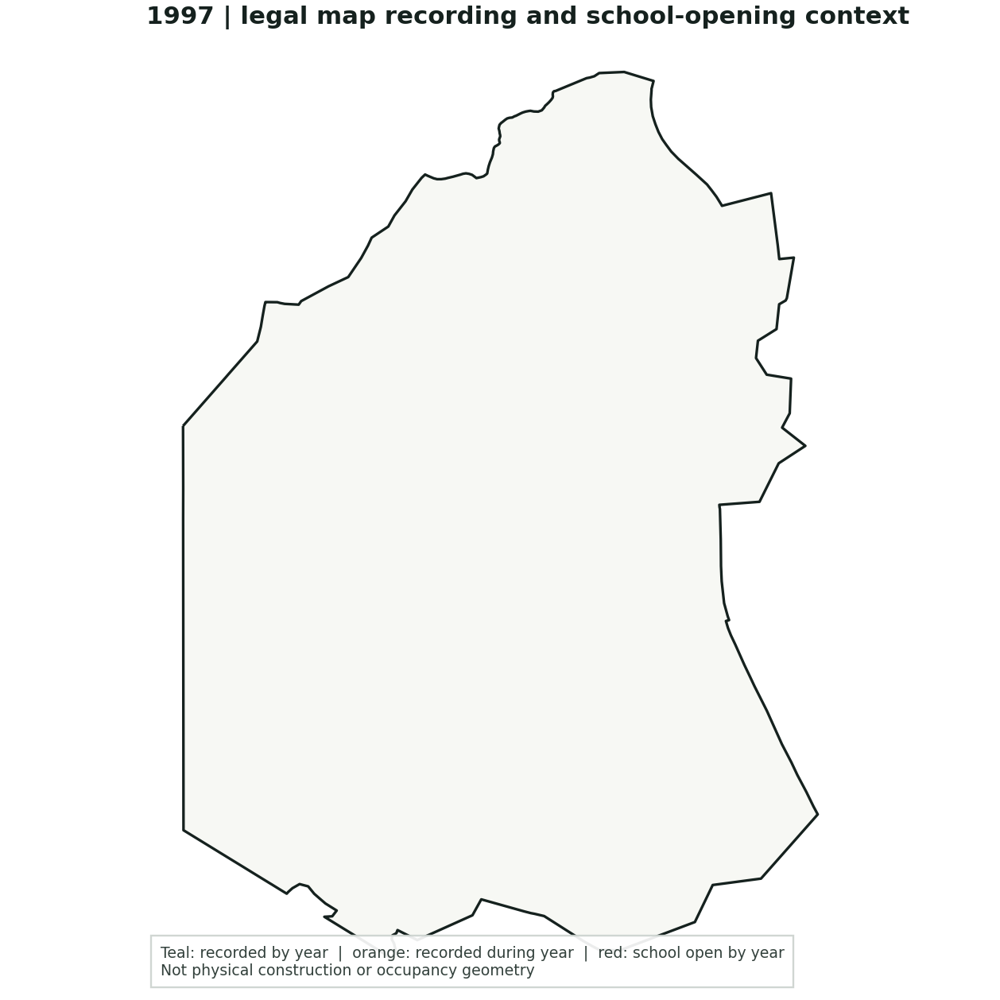

**Development-status map.** Derived counts show 0 legal tract maps recorded during the year and 0 cumulatively. These are not physical-development states.

**Construction map.** No supported active-construction geometry. The empty layer means unsupported, not no activity.

**Habitability and occupancy map.** No supported residential geometry. Community sales or first-resident milestones are not assigned to a tract or neighborhood.

**Schools and attendance.** Open school IDs: none. Historical attendance boundaries were not retrieved; proximity is not substituted for assignment.

**Roads and infrastructure.** No new dated road or infrastructure completion record.

**Parks, facilities, and commercial.** No new dated opening milestone.

**Historical imagery.** partial ambiguous date; available IDs: LH-IMG-1997-1998. The County service's 1997 Date_On_Map and 1998 DateCurrent fields do not support two separate annual states.

**Construction proximity.** Blocked because no temporally overlapping subject and target geometry satisfies the evidence threshold; zero comparisons were calculated.

**General wind context.** John Wayne Airport mean observed speed 3.648 m/s; easterly 11.65%; westerly 23.73%; valid-speed coverage 63.92%. Regional station observations are not downscaled.

**Terrain context.** The 2018 County DEM sample has a community median elevation of 148.3 m and median slope of 4.24 degrees. This post-study surface is not assigned as the historical terrain state for 1997.

**Confidence.** low. Annual records are evidence manifests; unchanged or unavailable fields do not imply historical absence.

**Evidence table.**

| Date | Milestone | Statement class | Confidence | Sources | Limitations |
|---|---|---|---|---|---|
| 1997-01-01 | Developer retrospective places County approval in 1997 | documented_approximate | low | `LH-SRC-RMV-PLANNING` | Preserved as a source claim, not treated as the exact entitlement action |

**School project evidence.** 0 DSA/opening milestones occur in this year; administrative dates are not exact physical construction dates.

**Conflicting evidence.** LH-CONFLICT-EIR-APPROVAL-DATE

**Remaining gaps.** Construction geometry; habitability geometry; occupancy geometry; historical attendance boundary; historical facility footprints.

**Sources.** `LH-SRC-RMV-PLANNING`

### 1998: Development Started

**Historical context.** Development begins; Original alternative development standards approved

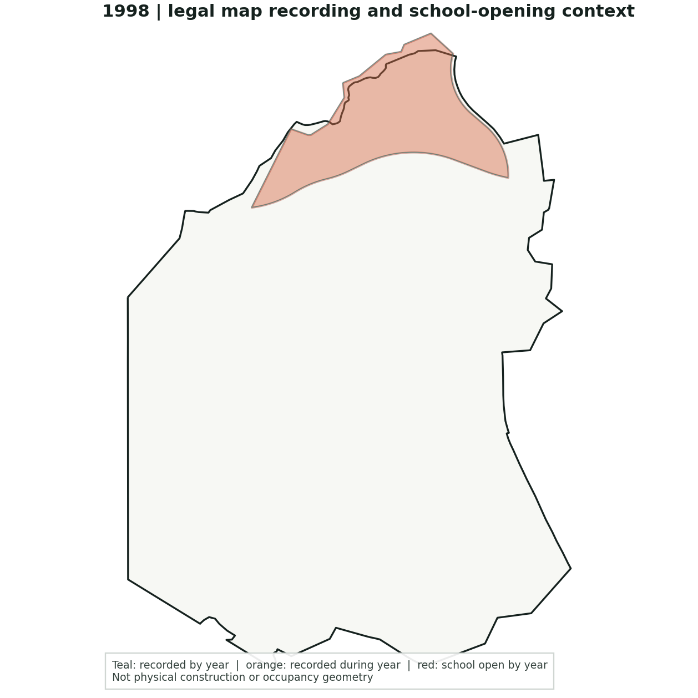

**Development-status map.** Derived counts show 1 legal tract maps recorded during the year and 1 cumulatively. These are not physical-development states.

**Construction map.** No supported active-construction geometry. The empty layer means unsupported, not no activity.

**Habitability and occupancy map.** No supported residential geometry. Community sales or first-resident milestones are not assigned to a tract or neighborhood.

**Schools and attendance.** Open school IDs: none. Historical attendance boundaries were not retrieved; proximity is not substituted for assignment.

**Roads and infrastructure.** No new dated road or infrastructure completion record.

**Parks, facilities, and commercial.** No new dated opening milestone.

**Historical imagery.** partial ambiguous date; available IDs: LH-IMG-1997-1998. The County service's 1997 Date_On_Map and 1998 DateCurrent fields do not support two separate annual states.

**Construction proximity.** Blocked because no temporally overlapping subject and target geometry satisfies the evidence threshold; zero comparisons were calculated.

**General wind context.** John Wayne Airport mean observed speed 3.713 m/s; easterly 9.56%; westerly 28.19%; valid-speed coverage 62.82%. Regional station observations are not downscaled.

**Terrain context.** The 2018 County DEM sample has a community median elevation of 148.3 m and median slope of 4.24 degrees. This post-study surface is not assigned as the historical terrain state for 1998.

**Confidence.** medium. Annual records are evidence manifests; unchanged or unavailable fields do not imply historical absence.

**Evidence table.**

| Date | Milestone | Statement class | Confidence | Sources | Limitations |
|---|---|---|---|---|---|
| 1998-01-01 | Development begins | documented_approximate | medium | `LH-SRC-ULI-CASE` | Substantial completion is separately dated to 2006 |
| 1998-04-07 | Original alternative development standards approved | documented_exact | high | `LH-SRC-OC-ADS` | Regulatory milestone only |

**School project evidence.** 0 DSA/opening milestones occur in this year; administrative dates are not exact physical construction dates.

**Conflicting evidence.** No year-linked conflict in the registry.

**Remaining gaps.** Construction geometry; habitability geometry; occupancy geometry; historical attendance boundary; historical facility footprints.

**Sources.** `LH-SRC-OC-ADS`, `LH-SRC-ULI-CASE`

### 1999: First Sales And Occupancy

**Historical context.** Phase 1 utility environmental record received; Alternative development standards approval; Dirt Tour sales begin; 93 new homes sold; First resident moves in

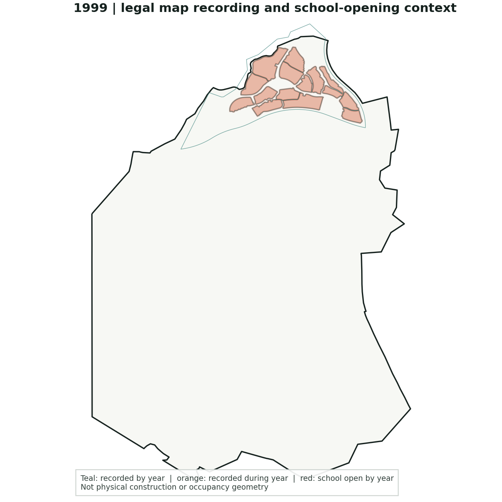

**Development-status map.** Derived counts show 14 legal tract maps recorded during the year and 15 cumulatively. These are not physical-development states.

**Construction map.** No supported active-construction geometry. The empty layer means unsupported, not no activity.

**Habitability and occupancy map.** No supported residential geometry. Community sales or first-resident milestones are not assigned to a tract or neighborhood.

**Schools and attendance.** Open school IDs: none. Historical attendance boundaries were not retrieved; proximity is not substituted for assignment.

**Roads and infrastructure.** Phase 1 utility environmental record received

**Parks, facilities, and commercial.** No new dated opening milestone.

**Historical imagery.** not located; available IDs: none. No public, locally archived image supports an annual state; zero coverage is not evidence of no construction.

**Construction proximity.** Blocked because no temporally overlapping subject and target geometry satisfies the evidence threshold; zero comparisons were calculated.

**General wind context.** John Wayne Airport mean observed speed 2.390 m/s; easterly 12.14%; westerly 31.03%; valid-speed coverage 91.69%. Regional station observations are not downscaled.

**Terrain context.** The 2018 County DEM sample has a community median elevation of 148.3 m and median slope of 4.24 degrees. This post-study surface is not assigned as the historical terrain state for 1999.

**Confidence.** medium. Annual records are evidence manifests; unchanged or unavailable fields do not imply historical absence.

**Evidence table.**

| Date | Milestone | Statement class | Confidence | Sources | Limitations |
|---|---|---|---|---|---|
| 1999-03-09 | Phase 1 utility environmental record received | documented_exact | high | `LH-SRC-CEQANET-UTILITIES` | Includes domestic and nondomestic water sewer force mains pump station and lift station |
| 1999-03-09 | Alternative development standards approval | documented_exact | high | `LH-SRC-OC-ADS` | Regulatory milestone only |
| 1999-08-01 | Dirt Tour sales begin | documented_exact | medium | `LH-SRC-LARMAC-TIMELINE` | Exact day not published |
| 1999-10-01 | 93 new homes sold | documented_exact | medium | `LH-SRC-LARMAC-TIMELINE` | Sales figure awaits original sales ledger corroboration |
| 1999-12-14 | First resident moves in | documented_exact | medium | `LH-SRC-LARMAC-TIMELINE` | Community-level event; village assignment is not encoded without a primary occupancy record |

**School project evidence.** 1 DSA/opening milestones occur in this year; administrative dates are not exact physical construction dates.

**Conflicting evidence.** No year-linked conflict in the registry.

**Remaining gaps.** Construction geometry; habitability geometry; occupancy geometry; historical attendance boundary; historical facility footprints.

**Sources.** `LH-SRC-CEQANET-UTILITIES`, `LH-SRC-LARMAC-TIMELINE`, `LH-SRC-OC-ADS`

### 2000: Active Construction And Occupancy

**Historical context.** Chief County Engineer approves standards supplement 3; 562 total new homes sold; Oak Knoll Clubhouse opens

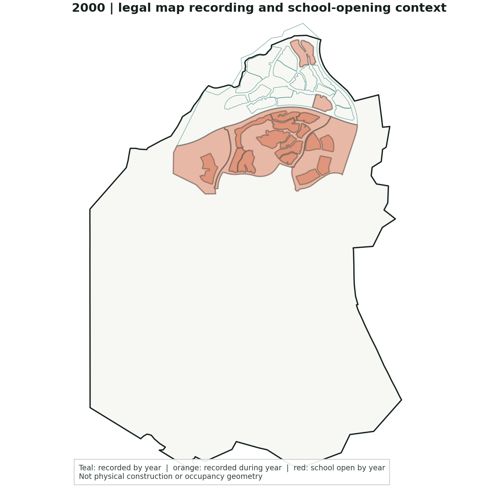

**Development-status map.** Derived counts show 20 legal tract maps recorded during the year and 35 cumulatively. These are not physical-development states.

**Construction map.** No supported active-construction geometry. The empty layer means unsupported, not no activity.

**Habitability and occupancy map.** No supported residential geometry. Community sales or first-resident milestones are not assigned to a tract or neighborhood.

**Schools and attendance.** Open school IDs: none. Historical attendance boundaries were not retrieved; proximity is not substituted for assignment.

**Roads and infrastructure.** No new dated road or infrastructure completion record.

**Parks, facilities, and commercial.** Oak Knoll Clubhouse opens

**Historical imagery.** not located; available IDs: none. No public, locally archived image supports an annual state; zero coverage is not evidence of no construction.

**Construction proximity.** Blocked because no temporally overlapping subject and target geometry satisfies the evidence threshold; zero comparisons were calculated.

**General wind context.** John Wayne Airport mean observed speed 2.257 m/s; easterly 12.55%; westerly 30.86%; valid-speed coverage 91.34%. Regional station observations are not downscaled.

**Terrain context.** The 2018 County DEM sample has a community median elevation of 148.3 m and median slope of 4.24 degrees. This post-study surface is not assigned as the historical terrain state for 2000.

**Confidence.** medium. Annual records are evidence manifests; unchanged or unavailable fields do not imply historical absence.

**Evidence table.**

| Date | Milestone | Statement class | Confidence | Sources | Limitations |
|---|---|---|---|---|---|
| 2000-02-28 | Chief County Engineer approves standards supplement 3 | documented_exact | high | `LH-SRC-OC-ADS` | Regulatory milestone only |
| 2000-03-01 | 562 total new homes sold | documented_exact | medium | `LH-SRC-LARMAC-TIMELINE` | Timeline reports 469 new and 562 total |
| 2000-03-01 | Oak Knoll Clubhouse opens | documented_exact | medium | `LH-SRC-LARMAC-TIMELINE` | Exact day not published |

**School project evidence.** 3 DSA/opening milestones occur in this year; administrative dates are not exact physical construction dates.

**Conflicting evidence.** No year-linked conflict in the registry.

**Remaining gaps.** Construction geometry; habitability geometry; occupancy geometry; historical attendance boundary; historical facility footprints.

**Sources.** `LH-SRC-LARMAC-TIMELINE`, `LH-SRC-OC-ADS`

### 2001: Active Construction And Occupancy

**Historical context.** 1546 total new homes sold; Ladera Ranch Sports Park opens; Chaparral Elementary opens; Bridgepark Plaza opens; Town Green opens

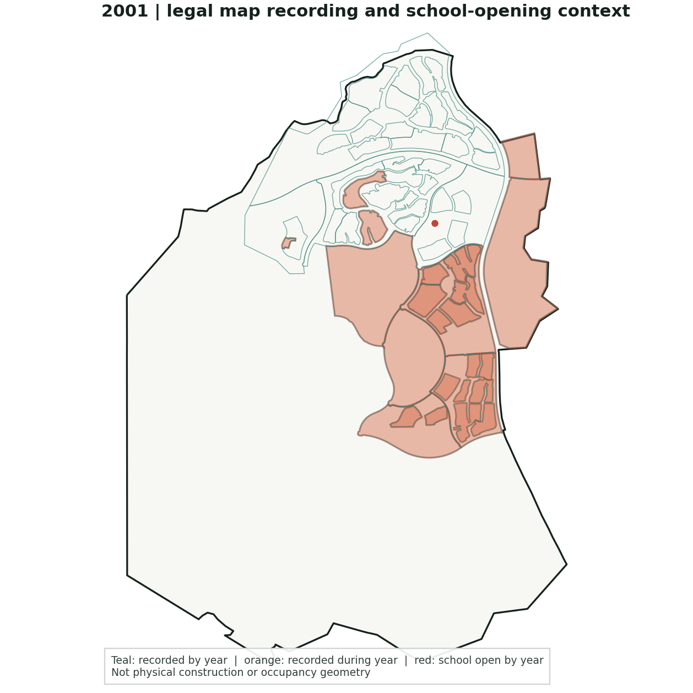

**Development-status map.** Derived counts show 24 legal tract maps recorded during the year and 59 cumulatively. These are not physical-development states.

**Construction map.** No supported active-construction geometry. The empty layer means unsupported, not no activity.

**Habitability and occupancy map.** No supported residential geometry. Community sales or first-resident milestones are not assigned to a tract or neighborhood.

**Schools and attendance.** Open school IDs: LH-SCHOOL-CHAPARRAL. Historical attendance boundaries were not retrieved; proximity is not substituted for assignment.

**Roads and infrastructure.** No new dated road or infrastructure completion record.

**Parks, facilities, and commercial.** Ladera Ranch Sports Park opens, Bridgepark Plaza opens, Town Green opens

**Historical imagery.** not located; available IDs: none. No public, locally archived image supports an annual state; zero coverage is not evidence of no construction.

**Construction proximity.** Blocked because no temporally overlapping subject and target geometry satisfies the evidence threshold; zero comparisons were calculated.

**General wind context.** John Wayne Airport mean observed speed 2.739 m/s; easterly 13.67%; westerly 29.22%; valid-speed coverage 80.92%. Regional station observations are not downscaled.

**Terrain context.** The 2018 County DEM sample has a community median elevation of 148.3 m and median slope of 4.24 degrees. This post-study surface is not assigned as the historical terrain state for 2001.

**Confidence.** medium. Annual records are evidence manifests; unchanged or unavailable fields do not imply historical absence.

**Evidence table.**

| Date | Milestone | Statement class | Confidence | Sources | Limitations |
|---|---|---|---|---|---|
| 2001-02-01 | 1546 total new homes sold | documented_exact | medium | `LH-SRC-LARMAC-TIMELINE` | Timeline reports 984 new and 31 neighborhoods open |
| 2001-06-01 | Ladera Ranch Sports Park opens | documented_exact | medium | `LH-SRC-LARMAC-TIMELINE` | Exact day not published |
| 2001-09-01 | Chaparral Elementary opens | documented_exact | high | `LH-SRC-CUSD-CHAPARRAL` | Exact day not published |
| 2001-10-01 | Bridgepark Plaza opens | documented_exact | medium | `LH-SRC-LARMAC-TIMELINE` | Exact day not published |
| 2001-10-01 | Town Green opens | documented_exact | medium | `LH-SRC-LARMAC-TIMELINE` | Exact day not published |

**School project evidence.** 3 DSA/opening milestones occur in this year; administrative dates are not exact physical construction dates.

**Conflicting evidence.** No year-linked conflict in the registry.

**Remaining gaps.** Construction geometry; habitability geometry; occupancy geometry; historical attendance boundary; historical facility footprints.

**Sources.** `LH-SRC-CUSD-CHAPARRAL`, `LH-SRC-LARMAC-TIMELINE`

### 2002: Active Construction And Occupancy

**Historical context.** 2488 total new homes sold; Avendale Village Clubhouse opens

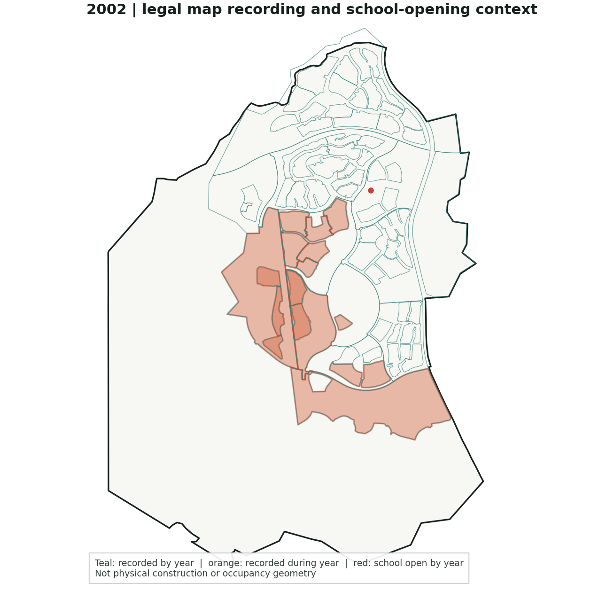

**Development-status map.** Derived counts show 17 legal tract maps recorded during the year and 76 cumulatively. These are not physical-development states.

**Construction map.** No supported active-construction geometry. The empty layer means unsupported, not no activity.

**Habitability and occupancy map.** No supported residential geometry. Community sales or first-resident milestones are not assigned to a tract or neighborhood.

**Schools and attendance.** Open school IDs: LH-SCHOOL-CHAPARRAL. Historical attendance boundaries were not retrieved; proximity is not substituted for assignment.

**Roads and infrastructure.** No new dated road or infrastructure completion record.

**Parks, facilities, and commercial.** Avendale Village Clubhouse opens

**Historical imagery.** not located; available IDs: none. No public, locally archived image supports an annual state; zero coverage is not evidence of no construction.

**Construction proximity.** Blocked because no temporally overlapping subject and target geometry satisfies the evidence threshold; zero comparisons were calculated.

**General wind context.** John Wayne Airport mean observed speed 2.387 m/s; easterly 11.84%; westerly 30.39%; valid-speed coverage 93.63%. Regional station observations are not downscaled.

**Terrain context.** The 2018 County DEM sample has a community median elevation of 148.3 m and median slope of 4.24 degrees. This post-study surface is not assigned as the historical terrain state for 2002.

**Confidence.** medium. Annual records are evidence manifests; unchanged or unavailable fields do not imply historical absence.

**Evidence table.**

| Date | Milestone | Statement class | Confidence | Sources | Limitations |
|---|---|---|---|---|---|
| 2002-03-01 | 2488 total new homes sold | documented_exact | medium | `LH-SRC-LARMAC-TIMELINE` | Timeline reports 942 new and 54 neighborhoods open |
| 2002-06-01 | Avendale Village Clubhouse opens | documented_exact | medium | `LH-SRC-LARMAC-TIMELINE` | Exact day not published |

**School project evidence.** 0 DSA/opening milestones occur in this year; administrative dates are not exact physical construction dates.

**Conflicting evidence.** No year-linked conflict in the registry.

**Remaining gaps.** Construction geometry; habitability geometry; occupancy geometry; historical attendance boundary; historical facility footprints.

**Sources.** `LH-SRC-LARMAC-TIMELINE`

### 2003: Active Construction And Occupancy

**Historical context.** 3987 total new homes sold; Founders Park opens; Ladera Ranch Library opens; Ladera Planned Community Program revised; Ladera Ranch School opens

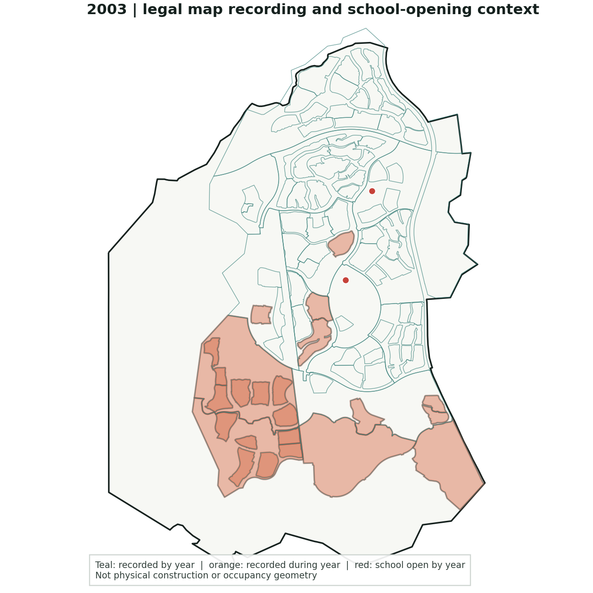

**Development-status map.** Derived counts show 23 legal tract maps recorded during the year and 99 cumulatively. These are not physical-development states.

**Construction map.** No supported active-construction geometry. The empty layer means unsupported, not no activity.

**Habitability and occupancy map.** No supported residential geometry. Community sales or first-resident milestones are not assigned to a tract or neighborhood.

**Schools and attendance.** Open school IDs: LH-SCHOOL-CHAPARRAL;LH-SCHOOL-LRES;LH-SCHOOL-LRMS. Historical attendance boundaries were not retrieved; proximity is not substituted for assignment.

**Roads and infrastructure.** No new dated road or infrastructure completion record.

**Parks, facilities, and commercial.** Founders Park opens, Ladera Ranch Library opens

**Historical imagery.** not located; available IDs: none. No public, locally archived image supports an annual state; zero coverage is not evidence of no construction.

**Construction proximity.** Blocked because no temporally overlapping subject and target geometry satisfies the evidence threshold; zero comparisons were calculated.

**General wind context.** John Wayne Airport mean observed speed 2.244 m/s; easterly 12.29%; westerly 28.47%; valid-speed coverage 97.98%. Regional station observations are not downscaled.

**Terrain context.** The 2018 County DEM sample has a community median elevation of 148.3 m and median slope of 4.24 degrees. This post-study surface is not assigned as the historical terrain state for 2003.

**Confidence.** high. Annual records are evidence manifests; unchanged or unavailable fields do not imply historical absence.

**Evidence table.**

| Date | Milestone | Statement class | Confidence | Sources | Limitations |
|---|---|---|---|---|---|
| 2003-04-01 | 3987 total new homes sold | documented_exact | medium | `LH-SRC-LARMAC-TIMELINE` | Timeline also reports population 6112 |
| 2003-07-01 | Founders Park opens | documented_exact | medium | `LH-SRC-LARMAC-TIMELINE` | Community timeline month conflicts with school reports exact August 27 opening; events are preserved separately |
| 2003-07-01 | Ladera Ranch Library opens | documented_exact | medium | `LH-SRC-LARMAC-TIMELINE` | Exact day not published |
| 2003-07-30 | Ladera Planned Community Program revised | documented_exact | high | `LH-SRC-OC-PC` | Statistical summary amended by Orange County Planning Commission |
| 2003-08-27 | Ladera Ranch School opens | documented_exact | high | `LH-SRC-CUSD-LRES`, `LH-SRC-CUSD-LRMS` | Shared elementary and middle campus |

**School project evidence.** 3 DSA/opening milestones occur in this year; administrative dates are not exact physical construction dates.

**Conflicting evidence.** LH-CONFLICT-SHARED-SCHOOL-OPENING

**Remaining gaps.** Construction geometry; habitability geometry; occupancy geometry; historical attendance boundary; historical facility footprints.

**Sources.** `LH-SRC-CUSD-LRES`, `LH-SRC-CUSD-LRMS`, `LH-SRC-LARMAC-TIMELINE`, `LH-SRC-OC-PC`

### 2004: Active Construction And Occupancy

**Historical context.** 5087 total new homes sold; Ladera Ranch School splits into elementary and middle schools; Flintridge and Covenant Hills village clubhouses open

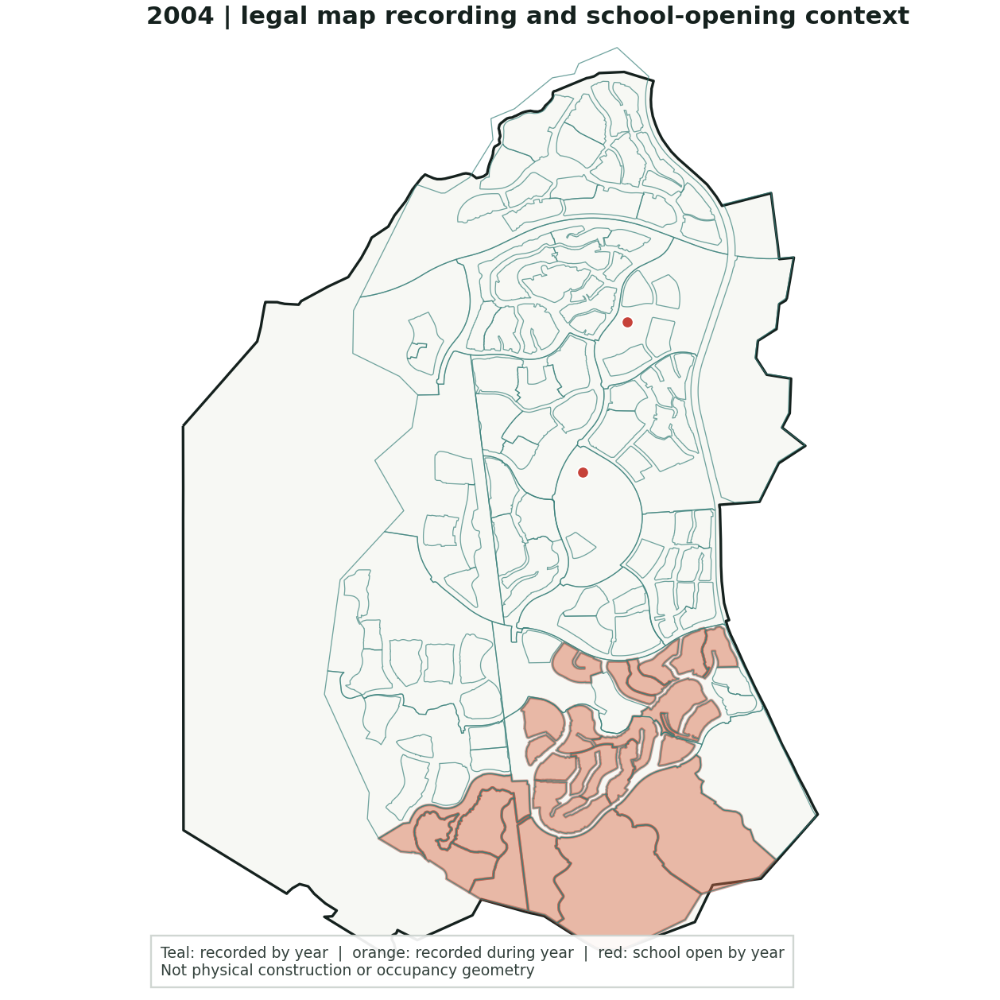

**Development-status map.** Derived counts show 22 legal tract maps recorded during the year and 121 cumulatively. These are not physical-development states.

**Construction map.** No supported active-construction geometry. The empty layer means unsupported, not no activity.

**Habitability and occupancy map.** No supported residential geometry. Community sales or first-resident milestones are not assigned to a tract or neighborhood.

**Schools and attendance.** Open school IDs: LH-SCHOOL-CHAPARRAL;LH-SCHOOL-LRES;LH-SCHOOL-LRMS. Historical attendance boundaries were not retrieved; proximity is not substituted for assignment.

**Roads and infrastructure.** No new dated road or infrastructure completion record.

**Parks, facilities, and commercial.** Flintridge and Covenant Hills village clubhouses open

**Historical imagery.** not located; available IDs: none. No public, locally archived image supports an annual state; zero coverage is not evidence of no construction.

**Construction proximity.** Blocked because no temporally overlapping subject and target geometry satisfies the evidence threshold; zero comparisons were calculated.

**General wind context.** John Wayne Airport mean observed speed 2.333 m/s; easterly 15.44%; westerly 24.74%; valid-speed coverage 97.96%. Regional station observations are not downscaled.

**Terrain context.** The 2018 County DEM sample has a community median elevation of 148.3 m and median slope of 4.24 degrees. This post-study surface is not assigned as the historical terrain state for 2004.

**Confidence.** medium. Annual records are evidence manifests; unchanged or unavailable fields do not imply historical absence.

**Evidence table.**

| Date | Milestone | Statement class | Confidence | Sources | Limitations |
|---|---|---|---|---|---|
| 2004-01-01 | 5087 total new homes sold | documented_exact | medium | `LH-SRC-LARMAC-TIMELINE` | Timeline reports 1100 new homes since prior milestone |
| 2004-01-01 | Ladera Ranch School splits into elementary and middle schools | documented_exact | high | `LH-SRC-CUSD-LRMS` | Exact date not published |
| 2004-12-01 | Flintridge and Covenant Hills village clubhouses open | documented_exact | medium | `LH-SRC-LARMAC-TIMELINE` | Exact days not published |

**School project evidence.** 2 DSA/opening milestones occur in this year; administrative dates are not exact physical construction dates.

**Conflicting evidence.** No year-linked conflict in the registry.

**Remaining gaps.** Construction geometry; habitability geometry; occupancy geometry; historical attendance boundary; historical facility footprints.

**Sources.** `LH-SRC-CUSD-LRMS`, `LH-SRC-LARMAC-TIMELINE`

### 2005: Active Construction And Occupancy

**Historical context.** 5879 total new homes sold; Oso Grande Elementary opens; Skate Park Wagsdale Park and Terramor Water Park open

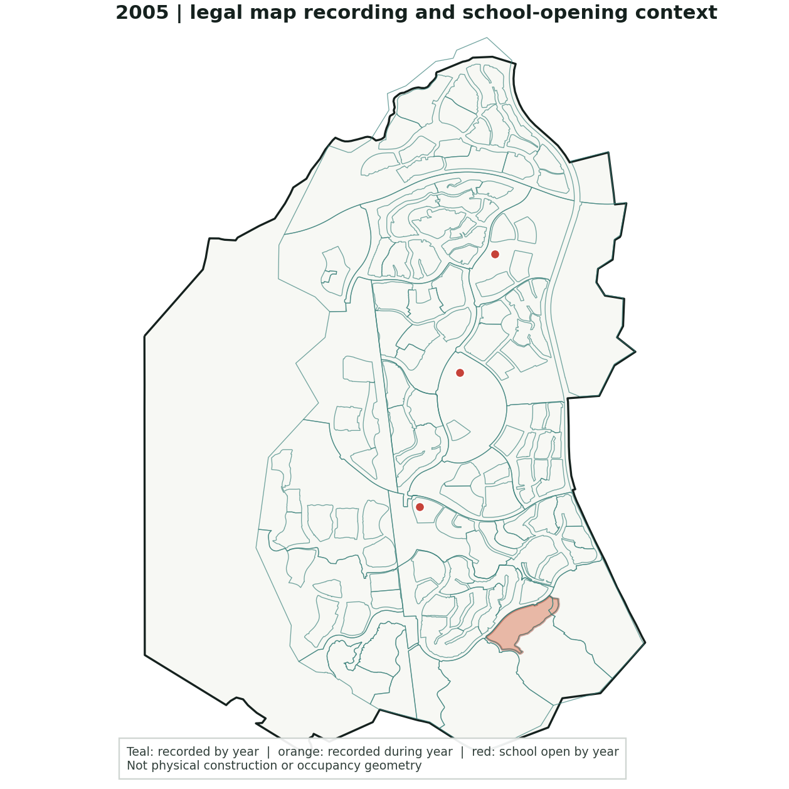

**Development-status map.** Derived counts show 1 legal tract maps recorded during the year and 122 cumulatively. These are not physical-development states.

**Construction map.** No supported active-construction geometry. The empty layer means unsupported, not no activity.

**Habitability and occupancy map.** No supported residential geometry. Community sales or first-resident milestones are not assigned to a tract or neighborhood.

**Schools and attendance.** Open school IDs: LH-SCHOOL-CHAPARRAL;LH-SCHOOL-LRES;LH-SCHOOL-LRMS;LH-SCHOOL-OSO-GRANDE. Historical attendance boundaries were not retrieved; proximity is not substituted for assignment.

**Roads and infrastructure.** No new dated road or infrastructure completion record.

**Parks, facilities, and commercial.** Skate Park Wagsdale Park and Terramor Water Park open

**Historical imagery.** not located; available IDs: none. No public, locally archived image supports an annual state; zero coverage is not evidence of no construction.

**Construction proximity.** Blocked because no temporally overlapping subject and target geometry satisfies the evidence threshold; zero comparisons were calculated.

**General wind context.** John Wayne Airport mean observed speed 2.113 m/s; easterly 13.78%; westerly 29.07%; valid-speed coverage 100.00%. Regional station observations are not downscaled.

**Terrain context.** The 2018 County DEM sample has a community median elevation of 148.3 m and median slope of 4.24 degrees. This post-study surface is not assigned as the historical terrain state for 2005.

**Confidence.** high. Annual records are evidence manifests; unchanged or unavailable fields do not imply historical absence.

**Evidence table.**

| Date | Milestone | Statement class | Confidence | Sources | Limitations |
|---|---|---|---|---|---|
| 2005-02-01 | 5879 total new homes sold | documented_exact | medium | `LH-SRC-LARMAC-TIMELINE` | Timeline reports 792 new homes since prior milestone |
| 2005-08-24 | Oso Grande Elementary opens | documented_exact | high | `LH-SRC-CDE-OSO` | Official registry date |
| 2005-11-01 | Skate Park Wagsdale Park and Terramor Water Park open | documented_exact | medium | `LH-SRC-LARMAC-TIMELINE` | Exact days not published |

**School project evidence.** 1 DSA/opening milestones occur in this year; administrative dates are not exact physical construction dates.

**Conflicting evidence.** No year-linked conflict in the registry.

**Remaining gaps.** Construction geometry; habitability geometry; occupancy geometry; historical attendance boundary; historical facility footprints.

**Sources.** `LH-SRC-CDE-OSO`, `LH-SRC-LARMAC-TIMELINE`

### 2006: Substantially Complete

**Historical context.** 6380 total new homes sold; Community substantially completed

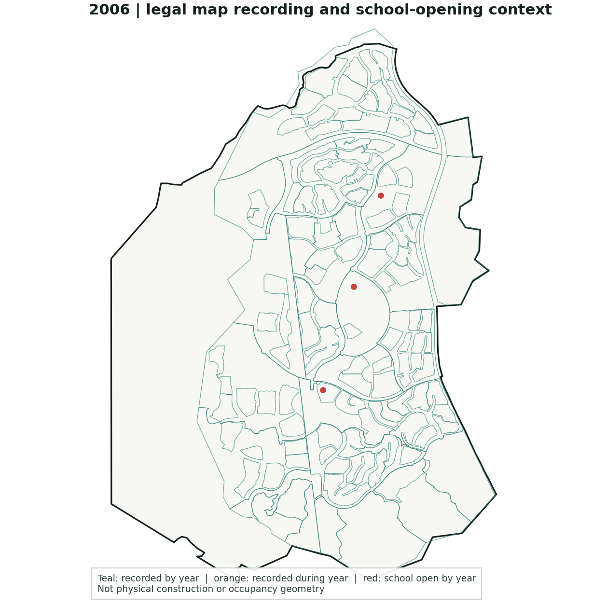

**Development-status map.** Derived counts show 0 legal tract maps recorded during the year and 122 cumulatively. These are not physical-development states.

**Construction map.** No supported active-construction geometry. The empty layer means unsupported, not no activity.

**Habitability and occupancy map.** No supported residential geometry. Community sales or first-resident milestones are not assigned to a tract or neighborhood.

**Schools and attendance.** Open school IDs: LH-SCHOOL-CHAPARRAL;LH-SCHOOL-LRES;LH-SCHOOL-LRMS;LH-SCHOOL-OSO-GRANDE. Historical attendance boundaries were not retrieved; proximity is not substituted for assignment.

**Roads and infrastructure.** No new dated road or infrastructure completion record.

**Parks, facilities, and commercial.** No new dated opening milestone.

**Historical imagery.** not located; available IDs: none. No public, locally archived image supports an annual state; zero coverage is not evidence of no construction.

**Construction proximity.** Blocked because no temporally overlapping subject and target geometry satisfies the evidence threshold; zero comparisons were calculated.

**General wind context.** John Wayne Airport mean observed speed 2.240 m/s; easterly 11.59%; westerly 31.02%; valid-speed coverage 99.97%. Regional station observations are not downscaled.

**Terrain context.** The 2018 County DEM sample has a community median elevation of 148.3 m and median slope of 4.24 degrees. This post-study surface is not assigned as the historical terrain state for 2006.

**Confidence.** medium. Annual records are evidence manifests; unchanged or unavailable fields do not imply historical absence.

**Evidence table.**

| Date | Milestone | Statement class | Confidence | Sources | Limitations |
|---|---|---|---|---|---|
| 2006-03-01 | 6380 total new homes sold | documented_exact | medium | `LH-SRC-LARMAC-TIMELINE` | Timeline reports 501 new homes since prior milestone |
| 2006-01-01 | Community substantially completed | documented_approximate | medium | `LH-SRC-ULI-CASE` | Custom lots and later sales remained |

**School project evidence.** 2 DSA/opening milestones occur in this year; administrative dates are not exact physical construction dates.

**Conflicting evidence.** No year-linked conflict in the registry.

**Remaining gaps.** Construction geometry; habitability geometry; occupancy geometry; historical attendance boundary; historical facility footprints.

**Sources.** `LH-SRC-LARMAC-TIMELINE`, `LH-SRC-ULI-CASE`

### 2007: Sold Out Except Custom

**Historical context.** Community sells out except custom lots

**Development-status map.** Derived counts show 0 legal tract maps recorded during the year and 122 cumulatively. These are not physical-development states.

**Construction map.** No supported active-construction geometry. The empty layer means unsupported, not no activity.

**Habitability and occupancy map.** No supported residential geometry. Community sales or first-resident milestones are not assigned to a tract or neighborhood.

**Schools and attendance.** Open school IDs: LH-SCHOOL-CHAPARRAL;LH-SCHOOL-LRES;LH-SCHOOL-LRMS;LH-SCHOOL-OSO-GRANDE. Historical attendance boundaries were not retrieved; proximity is not substituted for assignment.

**Roads and infrastructure.** No new dated road or infrastructure completion record.

**Parks, facilities, and commercial.** No new dated opening milestone.

**Historical imagery.** not located; available IDs: none. No public, locally archived image supports an annual state; zero coverage is not evidence of no construction.

**Construction proximity.** Blocked because no temporally overlapping subject and target geometry satisfies the evidence threshold; zero comparisons were calculated.

**General wind context.** John Wayne Airport mean observed speed 2.328 m/s; easterly 12.58%; westerly 28.52%; valid-speed coverage 100.00%. Regional station observations are not downscaled.

**Terrain context.** The 2018 County DEM sample has a community median elevation of 148.3 m and median slope of 4.24 degrees. This post-study surface is not assigned as the historical terrain state for 2007.

**Confidence.** medium. Annual records are evidence manifests; unchanged or unavailable fields do not imply historical absence.

**Evidence table.**

| Date | Milestone | Statement class | Confidence | Sources | Limitations |
|---|---|---|---|---|---|
| 2007-04-01 | Community sells out except custom lots | documented_exact | medium | `LH-SRC-LARMAC-TIMELINE` | Timeline reports 6585 total new homes sold |

**School project evidence.** 0 DSA/opening milestones occur in this year; administrative dates are not exact physical construction dates.

**Conflicting evidence.** No year-linked conflict in the registry.

**Remaining gaps.** Construction geometry; habitability geometry; occupancy geometry; historical attendance boundary; historical facility footprints.

**Sources.** `LH-SRC-LARMAC-TIMELINE`

### 2008: Late Custom Lot Phase

**Historical context.** 6631 total new homes sold

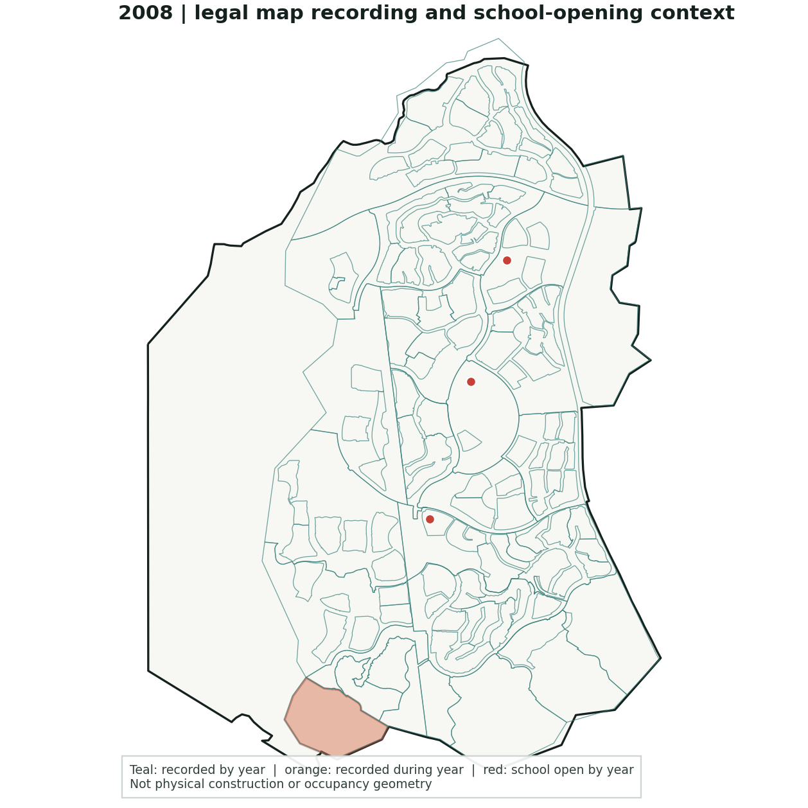

**Development-status map.** Derived counts show 1 legal tract maps recorded during the year and 123 cumulatively. These are not physical-development states.

**Construction map.** No supported active-construction geometry. The empty layer means unsupported, not no activity.

**Habitability and occupancy map.** No supported residential geometry. Community sales or first-resident milestones are not assigned to a tract or neighborhood.

**Schools and attendance.** Open school IDs: LH-SCHOOL-CHAPARRAL;LH-SCHOOL-LRES;LH-SCHOOL-LRMS;LH-SCHOOL-OSO-GRANDE. Historical attendance boundaries were not retrieved; proximity is not substituted for assignment.

**Roads and infrastructure.** No new dated road or infrastructure completion record.

**Parks, facilities, and commercial.** No new dated opening milestone.

**Historical imagery.** not located; available IDs: none. No public, locally archived image supports an annual state; zero coverage is not evidence of no construction.

**Construction proximity.** Blocked because no temporally overlapping subject and target geometry satisfies the evidence threshold; zero comparisons were calculated.

**General wind context.** John Wayne Airport mean observed speed 2.051 m/s; easterly 11.81%; westerly 30.85%; valid-speed coverage 99.74%. Regional station observations are not downscaled.

**Terrain context.** The 2018 County DEM sample has a community median elevation of 148.3 m and median slope of 4.24 degrees. This post-study surface is not assigned as the historical terrain state for 2008.

**Confidence.** medium. Annual records are evidence manifests; unchanged or unavailable fields do not imply historical absence.

**Evidence table.**

| Date | Milestone | Statement class | Confidence | Sources | Limitations |
|---|---|---|---|---|---|
| 2008-01-01 | 6631 total new homes sold | documented_exact | medium | `LH-SRC-LARMAC-TIMELINE` | Later custom-lot completion remains unresolved |

**School project evidence.** 0 DSA/opening milestones occur in this year; administrative dates are not exact physical construction dates.

**Conflicting evidence.** No year-linked conflict in the registry.

**Remaining gaps.** Construction geometry; habitability geometry; occupancy geometry; historical attendance boundary; historical facility footprints.

**Sources.** `LH-SRC-LARMAC-TIMELINE`

### 2009: No New Community State Established

**Historical context.** No new dated community milestone registered.

**Development-status map.** Derived counts show 0 legal tract maps recorded during the year and 123 cumulatively. These are not physical-development states.

**Construction map.** No supported active-construction geometry. The empty layer means unsupported, not no activity.

**Habitability and occupancy map.** No supported residential geometry. Community sales or first-resident milestones are not assigned to a tract or neighborhood.

**Schools and attendance.** Open school IDs: LH-SCHOOL-CHAPARRAL;LH-SCHOOL-LRES;LH-SCHOOL-LRMS;LH-SCHOOL-OSO-GRANDE. Historical attendance boundaries were not retrieved; proximity is not substituted for assignment.

**Roads and infrastructure.** No new dated road or infrastructure completion record.

**Parks, facilities, and commercial.** No new dated opening milestone.

**Historical imagery.** not located; available IDs: none. No public, locally archived image supports an annual state; zero coverage is not evidence of no construction.

**Construction proximity.** Blocked because no temporally overlapping subject and target geometry satisfies the evidence threshold; zero comparisons were calculated.

**General wind context.** John Wayne Airport mean observed speed 1.944 m/s; easterly 10.95%; westerly 33.44%; valid-speed coverage 99.97%. Regional station observations are not downscaled.

**Terrain context.** The 2018 County DEM sample has a community median elevation of 148.3 m and median slope of 4.24 degrees. This post-study surface is not assigned as the historical terrain state for 2009.

**Confidence.** unknown. Annual records are evidence manifests; unchanged or unavailable fields do not imply historical absence.

**Evidence table.** No new dated community event is registered for this year.

**School project evidence.** 0 DSA/opening milestones occur in this year; administrative dates are not exact physical construction dates.

**Conflicting evidence.** No year-linked conflict in the registry.

**Remaining gaps.** Construction geometry; habitability geometry; occupancy geometry; historical attendance boundary; historical facility footprints.

**Sources.** No source registered

### 2010: No New Community State Established

**Historical context.** No new dated community milestone registered.

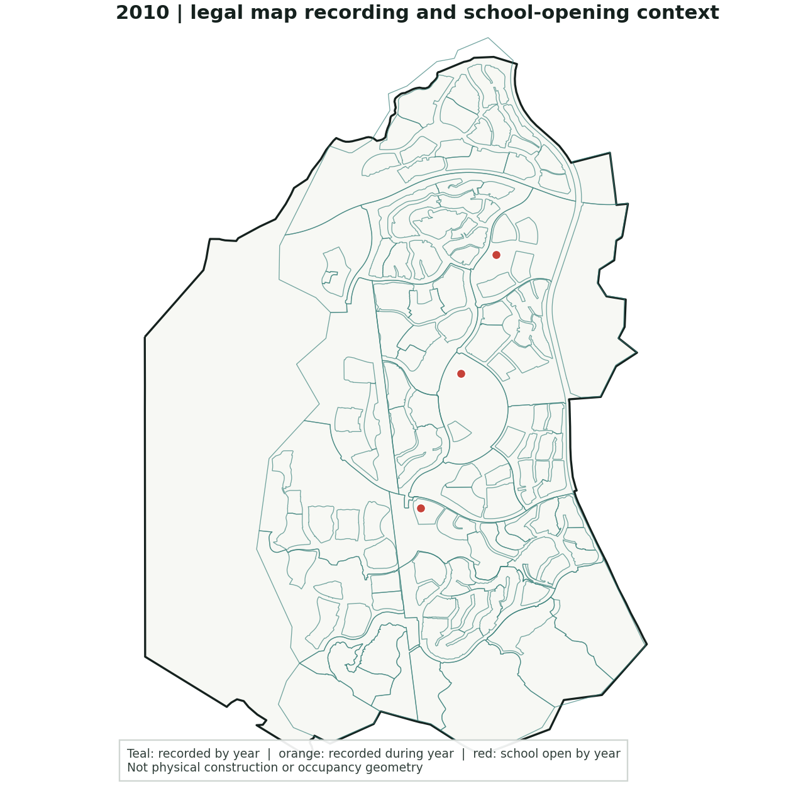

**Development-status map.** Derived counts show 0 legal tract maps recorded during the year and 123 cumulatively. These are not physical-development states.

**Construction map.** No supported active-construction geometry. The empty layer means unsupported, not no activity.

**Habitability and occupancy map.** No supported residential geometry. Community sales or first-resident milestones are not assigned to a tract or neighborhood.

**Schools and attendance.** Open school IDs: LH-SCHOOL-CHAPARRAL;LH-SCHOOL-LRES;LH-SCHOOL-LRMS;LH-SCHOOL-OSO-GRANDE. Historical attendance boundaries were not retrieved; proximity is not substituted for assignment.

**Roads and infrastructure.** No new dated road or infrastructure completion record.

**Parks, facilities, and commercial.** No new dated opening milestone.

**Historical imagery.** not located; available IDs: none. No public, locally archived image supports an annual state; zero coverage is not evidence of no construction.

**Construction proximity.** Blocked because no temporally overlapping subject and target geometry satisfies the evidence threshold; zero comparisons were calculated.

**General wind context.** John Wayne Airport mean observed speed 2.022 m/s; easterly 11.92%; westerly 32.21%; valid-speed coverage 99.98%. Regional station observations are not downscaled.

**Terrain context.** The 2018 County DEM sample has a community median elevation of 148.3 m and median slope of 4.24 degrees. This post-study surface is not assigned as the historical terrain state for 2010.

**Confidence.** unknown. Annual records are evidence manifests; unchanged or unavailable fields do not imply historical absence.

**Evidence table.** No new dated community event is registered for this year.

**School project evidence.** 0 DSA/opening milestones occur in this year; administrative dates are not exact physical construction dates.

**Conflicting evidence.** No year-linked conflict in the registry.

**Remaining gaps.** Construction geometry; habitability geometry; occupancy geometry; historical attendance boundary; historical facility footprints.

**Sources.** No source registered

## Wind and terrain figures

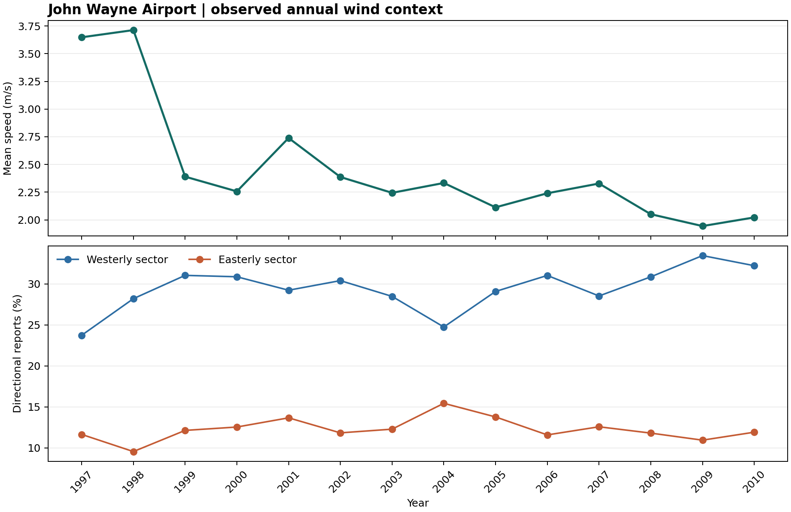

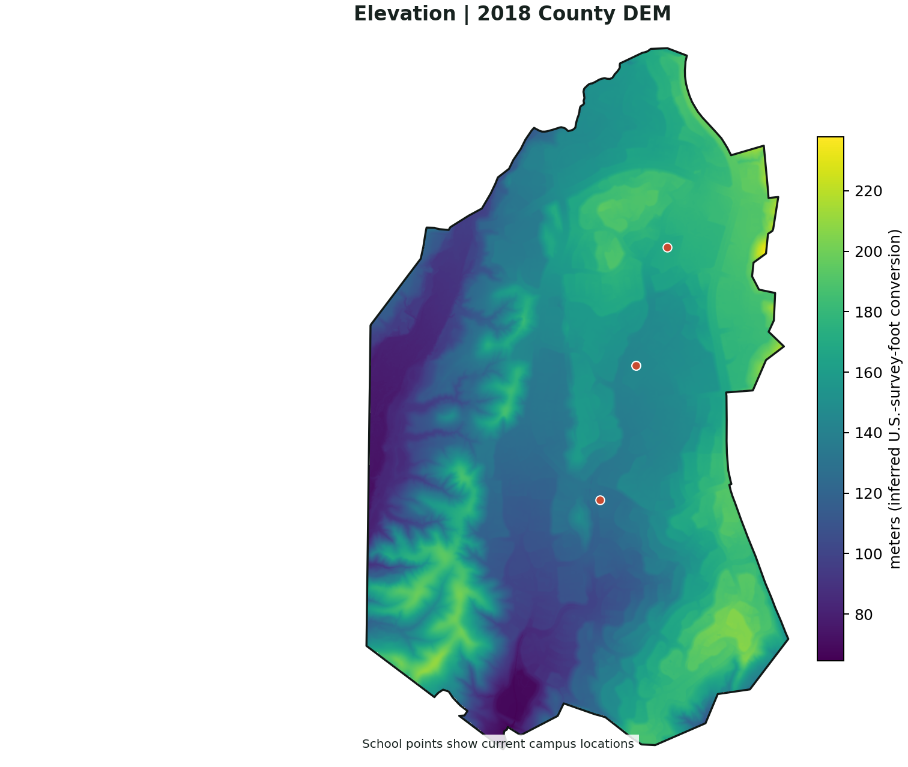

See `reports/LHDRS_Wind_and_Terrain_Context.html` for elevation, hillshade, slope, aspect, watershed, and drainage maps.

## Conflict registry

| ID | Subject | Conflict | Resolution | Status |
|---|---|---|---|---|
| LH-CONFLICT-EIR-APPROVAL-DATE | LH-FEAT-COMMUNITY | different_entitlement_milestones_or_date_conflict | Preserve both; use 1995-10-17 only for EIR certification and leave the 1997 action unresolved. | open_scope_distinction |
| LH-CONFLICT-SHARED-SCHOOL-OPENING | LH-SCHOOL-LRES;LH-SCHOOL-LRMS | month_grouping_versus_exact_date | Use 2003-08-27 for the school opening; retain July community park/library milestones separately. | resolved_by_authoritative_source |

## Research gaps

| Priority | Topic | Scope | Evidence needed | Access status | Follow-up |
|---|---|---|---|---|---|
| critical | tract_lifecycle | 123 tracts | grading, building, final, and occupancy records | private_or_manual_record_request | Request and archive the named record class; preserve a no-record response if applicable. |
| critical | historical_imagery | 1999-2010 annual states | dated overlapping aerial frames | account_or_manual_archive_search | Request and archive the named record class; preserve a no-record response if applicable. |
| critical | occupancy_geometry | residential areas | certificates of occupancy, closings, or address-level activation | nonpublic_or_manual_record_request | Request and archive the named record class; preserve a no-record response if applicable. |
| critical | construction_geometry | active development areas | dated grading/as-built plans or adjacent imagery | manual_record_request | Request and archive the named record class; preserve a no-record response if applicable. |
| high | tract_hierarchy | 123 tracts | planning-area, village, neighborhood, builder/product crosswalk | manual_crosswalk_and_records | Request and archive the named record class; preserve a no-record response if applicable. |
| high | school_boundaries | 1997-2010 attendance assignments | dated attendance maps and board actions | manual_district_request | Request and archive the named record class; preserve a no-record response if applicable. |
| high | roads | community streets and arterials | construction, partial opening, full opening, and access records | manual_record_request | Request and archive the named record class; preserve a no-record response if applicable. |
| high | haul_routes | construction access | explicit approved route plans | manual_record_request | Request and archive the named record class; preserve a no-record response if applicable. |
| medium | parks_facilities | community amenities | construction windows and historical footprints | manual_archive_search | Request and archive the named record class; preserve a no-record response if applicable. |
| medium | commercial | Bridgepark and later centers | tenant openings, construction intervals, historical footprints | manual_archive_search | Request and archive the named record class; preserve a no-record response if applicable. |
| medium | terrain_vertical_units | 2018 DEM | explicit band-value unit or vertical datum | metadata_clarification | Request and archive the named record class; preserve a no-record response if applicable. |
| medium | wind_locality | Ladera Ranch | on-site study-period station observations | not_located_publicly | Request and archive the named record class; preserve a no-record response if applicable. |

## Source registry

### LH-SRC-OC-PC: Ladera Planned Community Program

- Publisher: County of Orange OC Development Services
- URL: https://pwds.oc.gov/sites/ocpwocds/files/import/data/files/9266.pdf
- Reliability: A2
- Archive: `evidence/documents/Ladera_Planned_Community_Program_Text_1995_rev2003.pdf` (local_copy)
- SHA-256: `1922b1c9ca24097885ced31fb88dc2e971dc72a55b63e956f97178b91cbcfb9c`
- Limitations: Scanned image PDF; the current Census boundary is not its legal boundary

### LH-SRC-OC-MAP: Ladera Ranch Planned Community Map

- Publisher: County of Orange OC Development Services
- URL: https://pwds.oc.gov/sites/ocpwocds/files/import/data/files/9268.pdf
- Reliability: A2
- Archive: `evidence/lhdrs/county/Ladera_Ranch_Planned_Community_Map.pdf` (retrieved)
- SHA-256: `42cb618abcd8e67c38418688191f18c857e91d18f2c22f3db907e5bbd5c72527`
- Limitations: Single-sheet plan; digitization and registration still required

### LH-SRC-OC-DA: Ladera Ranch Development Agreement

- Publisher: County of Orange OC Development Services
- URL: https://pwds.oc.gov/sites/ocpwocds/files/import/data/files/9272.pdf
- Reliability: A2
- Archive: `evidence/lhdrs/county/Ladera_Ranch_Development_Agreement.pdf` (retrieved)
- SHA-256: `7e9f9d1eb783f77e011bea4eaca2f72334c78a3a6d3f0a245a5d8b9c6692dff3`
- Limitations: Legal agreement does not by itself establish physical completion dates

### LH-SRC-OC-ADS: Ladera Ranch Alternative Development Standards Version 4

- Publisher: County of Orange OC Development Services
- URL: https://pwds.oc.gov/sites/ocpwocds/files/import/data/files/9270.pdf
- Reliability: A2
- Archive: `evidence/lhdrs/county/Ladera_Ranch_Alternative_Development_Standards.pdf` (retrieved)
- SHA-256: `b0fcbcdc7896d14d0c680290120591e82e0c24ad9382527add5e4f1d7b48d2c1`
- Limitations: Approval and supplement dates are regulatory milestones rather than construction dates

### LH-SRC-CENSUS-CDP: Ladera Ranch Census Designated Place boundary

- Publisher: TIGERweb US Census Bureau
- URL: https://tigerweb.geo.census.gov/arcgis/rest/services/TIGERweb/Places_CouSub_ConCity_SubMCD/MapServer/5
- Reliability: A1
- Archive: `data/development/ladera_ranch_cdp.geojson` (generated_archive)
- SHA-256: `d41979ffa6f9ccc685021d74d83201c2e884d4e2bc36320013f97e561c69b040`
- Limitations: Current statistical boundary; not the 1997 planned-community or tract boundary

### LH-SRC-OC-TRACTS: Orange County Tract Maps GIS service

- Publisher: OC Public Works, OC Survey, Geospatial Services
- URL: https://ocgis.com/arcpub/rest/services/Map_Layers/Tract_Maps/MapServer/0
- Reliability: A1
- Archive: `data/development/tract_maps.geojson` (generated_archive)
- SHA-256: `18a875915f02608d2c8ddf50af2e9c3832a787680ba5ecb06f8166158606cc61`
- Limitations: Intersection with the current CDP includes maps that cross its edge; recording does not prove construction or occupancy

### LH-SRC-OC-IMAGERY: Orange County Historical Aerial Imagery v2

- Publisher: OC Public Works, OC Survey, Geospatial Services
- URL: https://ocgis.com/arcpub/rest/services/Historic_Imagery/Historic_Imagery_v2/ImageServer
- Reliability: A1
- Archive: `research/development_chronology/imagery_source_manifest.csv` (retrieved_collection)
- SHA-256: `c14c85414807c60ccbe032efb7e3df22aff3a96d3281f25a94e8f59e62f677df`
- Limitations: Service catalog dates distinguish Date_On_Map from DateCurrent; both usable development-era frames have partial coverage and scan or flight-footprint gaps.

### LH-SRC-CEQANET-UTILITIES: Phase 1 Ladera Development Area

- Publisher: California State Clearinghouse / Santa Margarita Water District
- URL: https://ceqanet.lci.ca.gov/1999031033
- Reliability: A2
- Archive: `evidence/lhdrs/web/ceqanet_1999031033.html` (retrieved)
- SHA-256: `cb0297fbdb002c48783e7b4902597cb89c95928009f9364955a2537cd44e15b7`
- Limitations: Summary record does not provide as-built completion dates

### LH-SRC-RMV-PLANNING: Responsible Planning

- Publisher: Rancho Mission Viejo
- URL: https://www.ranchomissionviejo.com/about/responsible-planning
- Reliability: B2
- Archive: `evidence/lhdrs/web/rmv_responsible_planning.html` (fetch_failed)
- SHA-256: `unavailable`
- Limitations: Developer-authored and promotional; use for its own chronology with corroboration where possible

### LH-SRC-LARMAC-TIMELINE: Explore Ladera Ranch - Ladera Ranch through the years

- Publisher: Ladera Ranch Maintenance Corporation
- URL: https://laderalife.com/about/explore-ladera-ranch
- Reliability: B2
- Archive: `evidence/lhdrs/web/laderalife_timeline.html` (retrieved)
- SHA-256: `2c2bfac90432cfb585898806f0d9b13cf8fc2bf1da1e3b54d662183df9bc4fa7`
- Limitations: Organization-authored retrospective; sales figures appear to be interval totals and require original sales records for independent verification

### LH-SRC-ULI-CASE: Ladera Ranch case study

- Publisher: Urban Land Institute
- URL: https://casestudies.uli.org/wp-content/uploads/2016/06/Ladera-Ranch.pdf
- Reliability: B1
- Archive: `evidence/lhdrs/publications/ULI_Ladera_Ranch_Case_Study.pdf` (fetch_failed)
- SHA-256: `unavailable`
- Limitations: Retrospective case study; not a permit or as-built record

### LH-SRC-CUSD-CHAPARRAL: 2022 School Accountability Report Card - Chaparral Elementary School

- Publisher: Capistrano Unified School District
- URL: https://www.capousd.org/documents/Schools/SARCS/Elementary/2022-SARC-Chaparral-Elementary-School.pdf
- Reliability: A2
- Archive: `evidence/lhdrs/schools/2022_SARC_Chaparral_Elementary.pdf` (retrieved)
- SHA-256: `ef76f10afdc4803d0456f263638b46d3013b151ff098b16aa105e220162e9b83`
- Limitations: Retrospective opening statement gives month but not day

### LH-SRC-CUSD-LRES: 2022 School Accountability Report Card - Ladera Ranch Elementary School

- Publisher: Capistrano Unified School District
- URL: https://www.capousd.org/documents/Schools/SARCS/Elementary/2022-SARC-Ladera-Ranch-Elementary-School.pdf
- Reliability: A2
- Archive: `evidence/lhdrs/schools/2022_SARC_Ladera_Ranch_Elementary.pdf` (retrieved)
- SHA-256: `732341b973b527b90ebebeb4bdb8bbac40f447115742443061f7cd2ff57a1f39`
- Limitations: Retrospective school report

### LH-SRC-CUSD-LRMS: 2022 School Accountability Report Card - Ladera Ranch Middle School

- Publisher: Capistrano Unified School District
- URL: https://www.capousd.org/documents/Schools/SARCS/Middle/2022-SARC-Ladera-Ranch-Middle-School.pdf
- Reliability: A2
- Archive: `evidence/lhdrs/schools/2022_SARC_Ladera_Ranch_Middle.pdf` (retrieved)
- SHA-256: `0e91c02f9cec22470a6ebf0c482f5d5b4f589ad99b744d71af88f32a5d77d160`
- Limitations: Retrospective school report

### LH-SRC-CDE-OSO: Oso Grande Elementary School Directory Details

- Publisher: California Department of Education
- URL: https://www.cde.ca.gov/schooldirectory/details?cdscode=30664640108704
- Reliability: A1
- Archive: `evidence/lhdrs/web/cde_oso_grande.html` (retrieved)
- SHA-256: `3ae6cd0afc006449c6408f1a9290a57afe096e59b1d6d5d548039650927291c4`
- Limitations: Registry gives opening date but not planning or construction window

### LH-SRC-NWS-ELTORO: El Toro climate summary

- Publisher: National Weather Service San Diego
- URL: https://www.weather.gov/sgx/orange-eltoro
- Reliability: A2
- Archive: `evidence/lhdrs/web/nws_el_toro_climate.html` (retrieved)
- SHA-256: `92a899492004d9d4bbfaf53cf6222c6f66597d64289c59b7a9dbae985afcdf8c`
- Limitations: Station is north of Ladera Ranch and local terrain can alter winds

### LH-SRC-NWS-SANTA-ANA: Mountain and Valley Winds - Santa Ana Winds

- Publisher: National Weather Service
- URL: https://www.weather.gov/safety/wind-mountain-valley
- Reliability: A2
- Archive: `evidence/lhdrs/web/nws_santa_ana_winds.html` (retrieved)
- SHA-256: `88756fb69d5f87cf814d4da56c7852644e42f8973623330fc89e49c31e3ec416`
- Limitations: Regional process description rather than site-specific measurements

### LH-SRC-OSM-SCHOOLS: OpenStreetMap building centroids for Ladera Ranch schools

- Publisher: OpenStreetMap contributors
- URL: https://www.openstreetmap.org
- Reliability: B2
- Archive: `data/development/schools.geojson` (local_copy)
- SHA-256: `1b17ef8f8743ff7db419a9f0b08b6460e71d814f6c953fde5b33a497aef6411a`
- Limitations: Community-maintained geometry; coordinates are building centroids rather than surveyed parcel points

### LH-SRC-OC-EIR-CERT: PA180010 Zoning Administrator Record

- Publisher: County of Orange OC Development Services
- URL: https://ocds.ocpublicworks.com/sites/ocpwocds/files/import/data/files/80931.pdf
- Reliability: A2
- Archive: `evidence/lhdrs/county/PA180010_Zoning_Administrator_Record.pdf` (retrieved)
- SHA-256: `a0ddfcc3f3a49776381a982348e7ad9cdabf3162961ec3d9cdfd6b75a4174003`
- Limitations: Retrospective 2018 staff record cites the 1995 EIR certification but does not include the original Board minutes

### LH-SRC-OC-LMS-TRACT-PDFS: Orange County recorded tract-map PDF collection

- Publisher: OC Public Works, OC Survey, Geospatial Services
- URL: https://www.ocgis.com/arcpub/rest/services/LMS/DocumentsandMaps/FeatureServer/999008
- Reliability: A1
- Archive: `research/development_chronology/tract_map_document_manifest.csv` (retrieved_collection)
- SHA-256: `540397c8c5ac9f29d65824b49af428c2ffc8c99a322a2707b949e1742842929c`
- Limitations: Title sheets document legal map facts and may cite prior maps but do not establish grading construction sale habitability or occupancy dates

### LH-SRC-NOAA-ISD-HISTORY: Integrated Surface Database station history

- Publisher: NOAA National Centers for Environmental Information
- URL: https://www.ncei.noaa.gov/pub/data/noaa/isd-history.csv
- Reliability: A1
- Archive: `evidence/lhdrs/noaa/isd-history.csv` (retrieved)
- SHA-256: `1994747ab4af1b97e63adb434b4d0d022f2daee76f0c144ea9ab46be2d906604`
- Limitations: Station distance and period of record do not establish representativeness at Ladera Ranch

### LH-SRC-NOAA-GLOBAL-HOURLY: Global Hourly integrated surface observations

- Publisher: NOAA National Centers for Environmental Information
- URL: https://www.ncei.noaa.gov/data/global-hourly/
- Reliability: A1
- Archive: `research/development_chronology/wind_source_manifest.csv` (retrieved_collection)
- SHA-256: `e7466377fe9f7798901c3d00c929ce53c447423b927200763caa8645be9d32dd`
- Limitations: Airport observations are regional context and may differ from Ladera Ranch because of terrain elevation station moves and instrumentation

### LH-SRC-OC-DEM-2018: Orange County 2018 one-meter digital elevation model

- Publisher: Orange County Public Works OC Survey
- URL: https://ocgis.com/arcpub/rest/services/Elevation/oc_dem_1m_2018/ImageServer
- Reliability: A1
- Archive: `research/development_chronology/terrain_source_manifest.csv` (retrieved_collection)
- SHA-256: `4c2cdbf1882310bd5335b0fd31f2f0d116c5ba7b068b782136c5b011b7a78d18`
- Limitations: Post-study-period terrain surface; grading may have changed landform since 1997-2010. The 2018 service metadata leaves the band-value unit element blank, so the U.S.-foot vertical interpretation is documented as an inference and converted explicitly.

### LH-SRC-OC-WATERSHEDS: Orange County watershed boundaries

- Publisher: Orange County Public Works
- URL: https://ocgis.com/arcpub/rest/services/Map_Layers/Watersheds/MapServer/0
- Reliability: A1
- Archive: `research/development_chronology/terrain_source_manifest.csv` (retrieved_collection)
- SHA-256: `4c2cdbf1882310bd5335b0fd31f2f0d116c5ba7b068b782136c5b011b7a78d18`
- Limitations: Current broad watershed boundary; does not establish historical site drainage, stormwater routing, or parcel-scale flow paths.

### LH-SRC-OC-STREAMS-2016: South Orange County stream centerlines

- Publisher: Orange County Public Works
- URL: https://ocgis.com/arcpub/rest/services/Environmental_Resources/South_OC_Stream_Centerlines/FeatureServer/0
- Reliability: A1
- Archive: `research/development_chronology/terrain_source_manifest.csv` (retrieved_collection)
- SHA-256: `4c2cdbf1882310bd5335b0fd31f2f0d116c5ba7b068b782136c5b011b7a78d18`
- Limitations: LiDAR-derived 2016 hydrographic context, not a historical 1997-2010 drainage map; centerlines do not by themselves distinguish perennial flow.

### LH-SRC-OC-FLOOD-CHANNELS: Orange County flood channels and as-built drawing inventory

- Publisher: Orange County Public Works
- URL: https://ocgis.com/arcpub/rest/services/Map_Layers/Flood_Channels/MapServer/0
- Reliability: A1
- Archive: `research/development_chronology/terrain_source_manifest.csv` (retrieved_collection)
- SHA-256: `4c2cdbf1882310bd5335b0fd31f2f0d116c5ba7b068b782136c5b011b7a78d18`
- Limitations: Inventory attributes may include design drawing dates while as-built fields remain blank; a drawing year is not treated as construction completion or occupancy evidence.

### LH-SRC-DGS-DSA-TRACKER: DSA eTracker school construction project records

- Publisher: California Department of General Services, Division of the State Architect
- URL: https://www.apps2.dgs.ca.gov/DSA/Tracker/ProjectStatus.aspx
- Reliability: A1
- Archive: `research/development_chronology/school_source_manifest.csv` (retrieved_collection)
- SHA-256: `1b72f15edc5d93cd82760a6644a54055907e3f27091c2f75ebc56bd6cb07bf35`
- Limitations: Plan receipt, approval, field-review, closeout, and certification dates are distinct administrative milestones; none is automatically the exact physical construction start.
